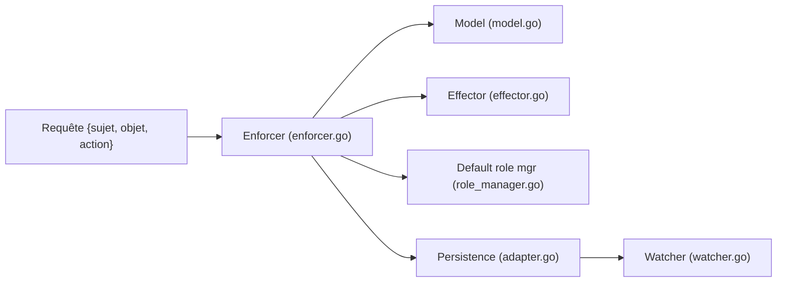

# apache/casbin

> Bibliothèque Go de contrôle d'accès, pilotée par un modèle de configuration, pour vérifier des droits dans une application.

Note : README identique à `casbin/casbin` ; probablement le même projet sous son nom actuel ou précédent.

## Le problème
Les règles d'accès codées en dur se modifient mal ; on veut les changer par configuration.

## Ce que ça fait vraiment
Un `Enforcer` charge un modèle `.conf` (requête, politique, effet, matchers) et des règles, puis décide autorisé ou refusé. D'après l'architecture décrite d'après le code : `effector/` réduit les règles correspondantes en une décision, `detector/` traite conflits et priorités, `rbac/` gère les rôles avec domaines, `persist/` fournit adaptateurs, cache et watchers, `transaction*.go` gère les mises à jour atomiques, `enforcer_synced.go` et `enforcer_distributed.go` couvrent concurrence et multi-nœuds.

## Comment c'est branché


## Essayer
```bash
go get github.com/casbin/casbin/v3
```
Le README fournit ensuite des exemples Go d'`Enforcer`, non reproduits ici.

## Coût et pièges
Gratuit, Apache-2.0. Une politique peut être stockée en fichier ou en base ; le README renvoie à une documentation externe pour les adaptateurs, watchers et rôles. Un éditeur en ligne aide à écrire les modèles.

## Ce que ce n'est pas
Pas un fournisseur d'identité : il ne fait pas d'authentification et ne stocke pas de mots de passe.

## Alternatives
Aucune alternative citée dans le README.

## Pour toi
Surveiller : utile si tes services sont en Go et exigent des droits fins ; hors Go, sans intérêt direct.

