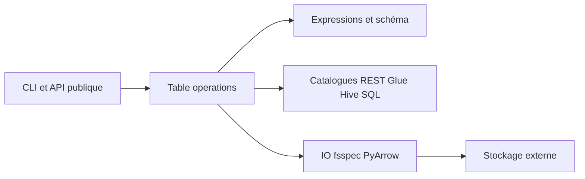

# apache/iceberg-python

> PyIceberg : bibliothèque Python pour lire les métadonnées et les données des tables Apache Iceberg.

## Le problème
Interroger ou modifier des tables Iceberg depuis Python sans passer par Spark ou un moteur JVM.

## Ce que ça fait vraiment
Le README ne dit presque rien : PyIceberg est l'implémentation Python de la spécification de tables Iceberg, avec une documentation en ligne. D'après le code : CLI, opérations de table, expressions, schémas et types, catalogues (REST, Glue, Hive, SQL, DynamoDB), E/S via fsspec et PyArrow, lecture et écriture Avro.

## Comment c'est branché

## Essayer
Aucune commande documentée dans le README ; voir la documentation en ligne.

## Coût et pièges
Le catalogue et le stockage (S3, etc.) sont à ta charge. Le nom du paquet pip n'est pas donné dans le README. 269 issues ouvertes.

## Ce que ce n'est pas
Ce n'est pas un moteur de requête : il donne accès aux tables et aux métadonnées.

## Alternatives
Aucune alternative nommée dans le README.

## Pour toi
Adopter : projet Apache actif qui te donne les tables Iceberg depuis Python, à condition de lire la documentation en ligne, faute de contenu dans le README.

