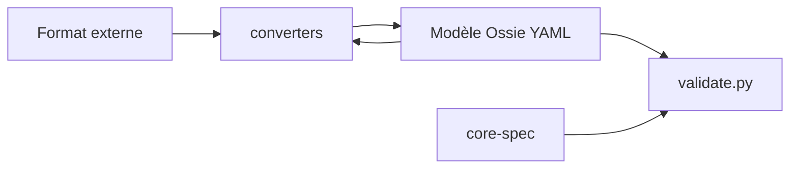

# apache/ossie

> Spécification ouverte de modèle sémantique pour échanger les définitions métier entre outils BI et agents IA.

## Le problème
Le même KPI est défini différemment dans chaque outil, et les agents IA produisent des résultats peu fiables sur une logique métier incohérente.

## Ce que ça fait vraiment
Fournit une spécification JSON/YAML (`core-spec/spec.md`, `spec.yaml`, schéma JSON), un validateur (`validation/validate.py`), des exemples (TPC-DS) et des convertisseurs de référence : dbt, Omni, Orionbelt, GoodData, Honeydew en Python ; Polaris et Salesforce en Java. Ancien nom : Open Semantic Interchange (OSI). Projet en incubation Apache.

## Comment c'est branché

## Essayer
Aucune commande documentée dans le README.

## Coût et pièges
Gratuit. Spécification jeune (dépôt créé en novembre 2025) : les convertisseurs peuvent signaler des correspondances avec perte. Le README ne détaille pas d'installation.

## Ce que ce n'est pas
Pas une couche sémantique exécutable ni un service : c'est une spécification avec adaptateurs. Aucun runtime unifié.

## Alternatives
Le README cite dbt, GoodData, Polaris et Salesforce comme formats à convertir, pas comme concurrents.

## Pour toi
À surveiller : un standard d'échange de sémantique métier peut compter pour les agents sur données, mais reste en incubation.

