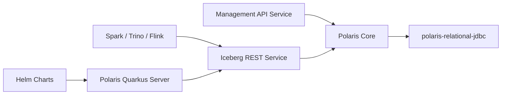

# apache/polaris

> Catalogue open source pour Apache Iceberg, implémentant l'API REST Iceberg pour plusieurs moteurs.

## Le problème
Plusieurs moteurs (Spark, Trino, Flink) doivent partager des tables Iceberg avec un catalogue unique, sans dépendre d'un fournisseur.

## Ce que ça fait vraiment
Serveur Quarkus qui expose l'API REST Iceberg et une API de gestion. Le cœur (`polaris-core`) gère entités et logique, la persistance passe par JDBC relationnel ; des extensions couvrent la fédération de catalogues (Hive, Hadoop, BigQuery) et l'autorisation externe (OPA, Ranger). Un client Python, un plugin Spark, des charts Helm et un outil d'administration sont fournis.

## Comment c'est branché


## Essayer
```bash
docker run -p 8181:8181 -p 8182:8182 apache/polaris:latest
./gradlew run
./regtests/run_spark_sql.sh
```

## Coût et pièges
Construction avec Java 21+ et Docker 27+. Identifiants par défaut `POLARIS,root,s3cr3t` à remplacer. 388 issues ouvertes. Le README ne chiffre pas les ressources nécessaires.

## Ce que ce n'est pas
Pas un moteur de requête ni un stockage : il tient le catalogue de métadonnées Iceberg.

## Alternatives
- Aucune alternative nommée dans le README.

## Pour toi
Surveiller : utile si ta plateforme data repose sur Iceberg multi-moteurs, hors sujet sinon.
