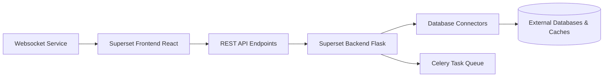

# apache/superset

> Application web de BI open source : exploration SQL, graphiques sans code, tableaux de bord.

## Le problème
Donner aux équipes des tableaux de bord sur leurs bases SQL sans payer une licence de BI propriétaire.

## Ce que ça fait vraiment
Frontend React (constructeur de graphiques sans code, éditeur SQL Lab, tableaux de bord) au-dessus d'un backend Python Flask exposant une API REST.
Le backend interroge quasiment toute base SQL via des connecteurs SQLAlchemy, avec couche sémantique légère (dimensions, métriques), cache configurable et rôles de sécurité (RBAC).
Les requêtes longues passent par des tâches asynchrones Celery ; un service WebSocket séparé pousse l'avancement au navigateur. Extensible : plugins de visualisation et connecteurs. L'analyse d'architecture fournie est générique.

## Comment c'est branché

## Essayer
Aucune commande dans le README : il renvoie au guide de démarrage rapide et au tutoriel « Superset in 2 Minutes using Docker Compose ».

## Coût et pièges
Gratuit, Apache-2.0. En production, prévoir base de métadonnées, cache et broker Celery : c'est toi qui opères.

## Ce que ce n'est pas
Pas un outil de préparation de données ni un entrepôt : il visualise ce que tes bases exposent. La couche sémantique est « légère » : pas un outil de modélisation complet.

## Alternatives
Aucune alternative nommée dans le README.

## Pour toi
À adopter pour exposer des résultats de modèles ou des métriques de données à des non-techniciens.
