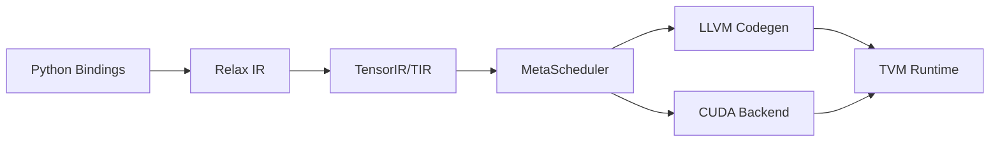

# apache/tvm

> Compilateur de modèles ML, Python-first, pour déployer sur de nombreux matériels.

## Le problème
Un modèle entraîné doit tourner vite sur CPU, GPU, mobile ou accélérateurs variés, chacun avec ses bibliothèques.

## Ce que ça fait vraiment
Représentation graphe (Relax) et tenseur (TensorIR) optimisables conjointement, transformations écrites en Python.
MetaScheduler pour l'auto-tuning des schedules.
Génération de code LLVM, CUDA, ROCm, Vulkan, OpenCL, Metal, WebGPU ; runtime avec RPC.
Base pour des compilateurs verticaux, notamment LLM.

## Comment c'est branché

## Essayer
Aucune commande documentée dans le README (renvoi vers la documentation).

## Coût et pièges
Gratuit ; installation souvent par compilation, courbe d'apprentissage réelle.

## Ce que ce n'est pas
Pas un serveur d'inférence prêt à l'emploi ; la design actuelle diffère fortement des anciennes versions (Relay).

## Alternatives
Aucune alternative nommée comme dépôt ; Halide, Loopy et Theano sont cités comme inspirations.

## Pour toi
À surveiller : utile si tu cibles du déploiement edge optimisé, excessif pour servir un modèle sur GPU standard.
