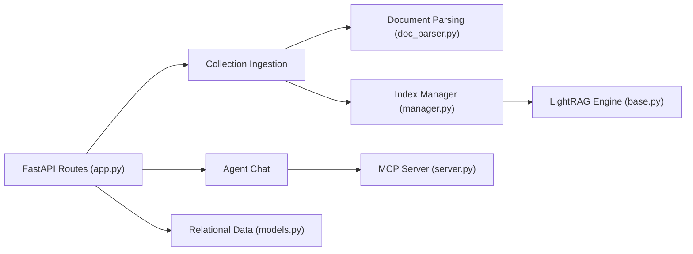

# apecloud/ApeRAG

> Plateforme RAG auto-hébergée mêlant graphe, vecteurs et plein texte, avec agents et MCP, pour équipes IA.

## Le problème
Construire une base de connaissance interrogeable par LLM demande d'assembler parsing, index vectoriel, graphe, recherche plein texte et agents.

## Ce que ça fait vraiment
API FastAPI, interface React et tâches Celery. Cinq types d'index (vecteur, plein texte, graphe, résumé, vision), un moteur de graphe dérivé de LightRAG avec fusion d'entités, parsing avancé via MinerU (GPU optionnel), agents avec outils MCP et recherche web, journal d'audit. Déploiement Helm/KubeBlocks pour PostgreSQL, Redis, Qdrant, Elasticsearch, Neo4j.

## Comment c'est branché


## Essayer
```bash
git clone https://github.com/apecloud/ApeRAG.git
cd ApeRAG
cp envs/env.template .env
docker-compose up -d --pull always
```
Interface sur `http://localhost:3000/web/`, API sur `http://localhost:8000/docs`.

## Coût et pièges
Minimum 2 cœurs, 4 Go de RAM, Docker. Le service `doc-ray` demande 4+ cœurs et 8 Go+. Une clé de LLM est à ta charge (non détaillée dans ce README).

## Ce que ce n'est pas
Pas une simple bibliothèque : c'est une pile complète à quatre bases de données en mode Kubernetes. Les formulations « meilleur choix » du README sont du marketing.

## Alternatives
LightRAG : le moteur de graphe sur lequel ApeRAG s'appuie.

## Pour toi
À surveiller : pertinent si tu veux un RAG avec graphe clé en main et acceptes l'infrastructure ; pour un prototype, LightRAG seul est plus léger.

