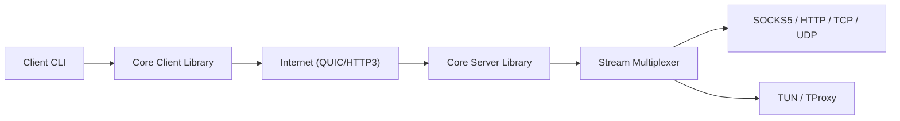

# apernet/hysteria

> Proxy en Go basé sur QUIC, conçu pour résister à la censure.

## Le problème
Contourner des restrictions réseau avec un proxy rapide et difficile à identifier.

## Ce que ça fait vraiment
README réduit à des badges, des liens et un slogan. D'après le code : client et serveur Go avec un protocole propre au-dessus de QUIC, camouflé en HTTP/3, plusieurs modes de proxy (SOCKS5, HTTP, redirection TCP/UDP, TProxy, TUN), authentification et contrôle d'accès pluggables, contrôle de congestion (BBR cité), obfuscation et journal de trafic dans `extras/`.

## Comment c'est branché

## Essayer
Aucune commande documentée dans le README fourni ; la documentation est sur le site du projet.

## Coût et pièges
Gratuit. Nécessite un serveur à toi (non précisé dans le README fourni). Une version 1.x est signalée comme ancienne. Dépend de la légalité de l'usage dans ton pays.

## Ce que ce n'est pas
Ce n'est pas un VPN clé en main ni un outil d'anonymat garanti. Le README fourni ne documente rien de l'usage.

## Alternatives
Aucune alternative nommée dans le README.

## Pour toi
Ignorer : matière du README insuffisante et outil de contournement réseau sans lien avec le travail data/IA/MLOps.

