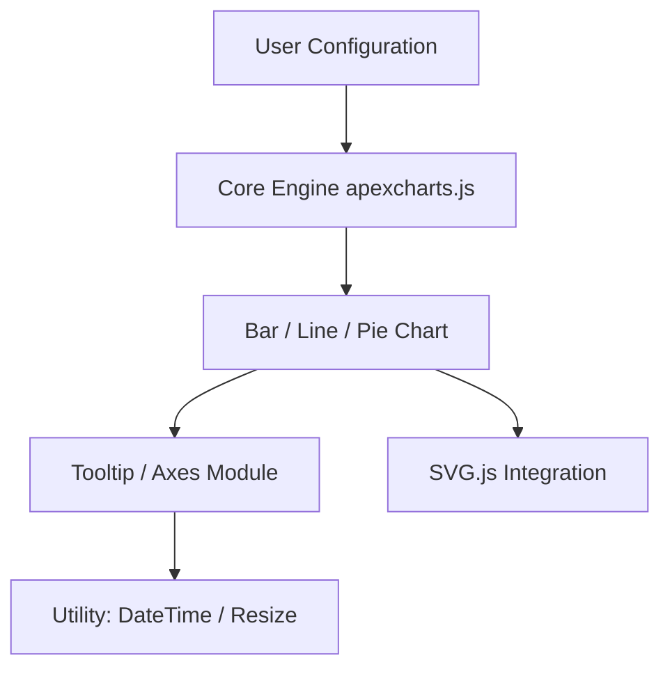

# apexcharts/apexcharts.js

> Bibliothèque JavaScript de graphiques interactifs pour tableaux de bord web, compatible SSR.

## Le problème
Construire des graphiques interactifs dans une appli web sans dépendre de D3 et de son code bas niveau.

## Ce que ça fait vraiment
Plus de 18 types de graphiques (ligne, barres, heatmap, treemap, chandeliers, violon…), en SVG, avec un rendu canvas pour les séries denses.
Rendu côté serveur (Next, Nuxt, SvelteKit) puis hydratation. On peut importer seulement les briques utiles pour alléger le bundle. Types TypeScript inclus.
La v6 apporte des plugins, l'annuler/rétablir, le crossfilter, l'édition d'annotations et le streaming.
Des wrappers existent pour React, Vue, Angular et Blazor.

## Comment c'est branché


## Essayer
```bash
npm install apexcharts
```

## Coût et pièges
Certaines fonctions sont payantes (unit, raincloud, crossfilter, historique, perspectives…). Sans clé, un filigrane « APEXCHARTS » s'affiche sur les graphiques qui les utilisent.

## Ce que ce n'est pas
Ce n'est pas une bibliothèque Python : pour tes notebooks, ce n'est pas l'outil. « Free for most users » n'est pas une licence open source claire, et GitHub ne l'identifie pas.

## Alternatives
Le README ne nomme que ses propres wrappers (react-apexcharts, vue3-apexcharts…), pas de concurrents.

## Pour toi
À ignorer : c'est du front JS avec une licence ambiguë. Pour tes visualisations, reste sur l'écosystème Python.
