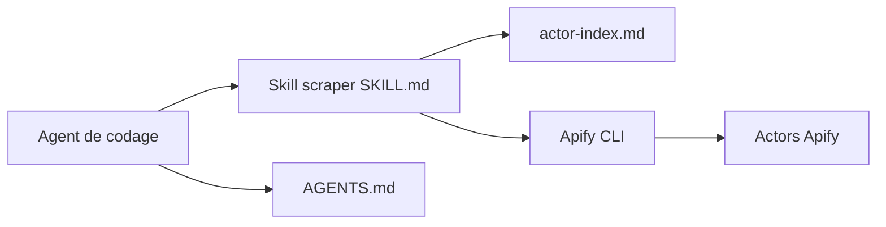

# apify/agent-skills

> Skills pour agents de codage : scraping via les Actors Apify, création et intégration d'Actors.

## Le problème
Un agent de codage doit choisir le bon outil de collecte parmi des milliers, façonner ses entrées et gérer les exécutions.

## Ce que ça fait vraiment
Cinq skills : `apify-ultimate-scraper` (130+ Actors sélectionnés, repli sur le catalogue de plus de 30 000), `apify-actor-development`, `apify-actorization`, `apify-generate-output-schema`, `apify-integration-development`, plus des commandes comme `/create-actor`. L'agent choisit l'Actor, prépare l'entrée, lance l'exécution et formate les résultats. Les instructions des skills n'ont pas été examinées dans l'architecture.

## Comment c'est branché


## Essayer
```bash
npx skills add https://github.com/apify/agent-skills --skill apify-ultimate-scraper
/plugin marketplace add https://github.com/apify/agent-skills
npm install -g apify-cli
apify login
```

## Coût et pièges
Compte Apify (niveau gratuit), Apify CLI, Node 20.6+. Les Actors sont facturés au résultat ou à l'événement, fixés par chaque Actor. Le scraping de réseaux sociaux soulève des questions de conditions d'utilisation et de données personnelles, non traitées dans le README.

## Ce que ce n'est pas
Pas un scraper autonome : tout passe par la plateforme Apify payante à l'usage. Aucune licence déclarée au catalogue.

## Alternatives
Le README cite `apify/awesome-skills` (compétences communautaires) et `mcp.apify.com` (serveur MCP hébergé).

## Pour toi
À surveiller : utile pour alimenter des jeux de données web depuis un agent, mais le coût à l'usage et l'absence de licence demandent un cadrage avant tout usage durable.

