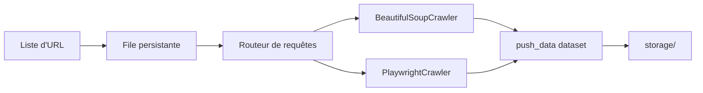

# apify/crawlee-python

> Bibliothèque asyncio de crawl et de scraping, HTTP ou navigateur, avec file persistante.

## Le problème
Un scraper écrit à la main finit toujours par manquer les reprises sur erreur, la rotation de proxys,
la persistance de la file d'URL et la reprise après interruption.

## Ce que ça fait vraiment
Deux crawlers principaux partageant une interface : `BeautifulSoupCrawler`, qui télécharge en HTTP
(client `ImpitHttpClient` par défaut) et fournit le HTML parsé, rapide car sans navigateur ;
`PlaywrightCrawler`, qui pilote un navigateur sans tête pour les pages dépendant du JavaScript client.
Chaque crawler définit un routeur de requêtes, un `push_data` vers un dataset et `enqueue_links` pour
suivre les liens. Parallélisme automatique selon les ressources, reprises sur erreur ou blocage,
rotation de proxys et sessions, stockage tabulaire ou fichiers dans `storage/`.

## Comment c'est branché


## Essayer
```sh
python -m pip install 'crawlee[all]'
playwright install
python -c 'import crawlee; print(crawlee.__version__)'
uvx 'crawlee[cli]' create my-crawler
```

## Coût et pièges
Gratuit et exécutable partout. Les extras comptent : `beautifulsoup` et `playwright` s'installent
séparément pour limiter le poids, et Playwright exige ensuite ses navigateurs. Chaque exécution crée un
répertoire `storage/` dans le dossier courant.

## Ce que ce n'est pas
Pas un outil sans état : la persistance de file et de session est le cœur, pas une option.
Pas un service : l'exécution sur la plateforme Apify est proposée, mais c'est un déploiement distinct.
Le comportement « presque humain » face aux protections anti-bot reste une affirmation du README.

## Alternatives
- **Scrapy** : comparé explicitement — sans asyncio, sans annotations de type, avec son propre lanceur.
- **Crawlee pour JS/TS** : même bibliothèque, écosystème Node.

## Pour toi
Le bon choix pour construire un collecteur de données durable plutôt qu'un script jetable.
