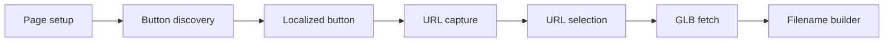

# apinanaivot/IKEA-3D-Model-Download-Button

> Script Tampermonkey qui ajoute un bouton pour télécharger les modèles 3D GLB des fiches produit IKEA.

## Le problème
Pour essayer des meubles dans un logiciel 3D, il faut récupérer les modèles que le site n'affiche que dans son visionneur.

## Ce que ça fait vraiment
- Ajoute « Download 3D » à côté de « View in 3D » sur les pages produit, dans toutes les langues du site.
- Repère l'URL du modèle, le télécharge en `.glb` et le nomme `[Produit] - [Couleur].glb`.
- Observe le contenu chargé dynamiquement et propose une sélection manuelle du bouton.
- Un seul fichier source : `ikea-3d-model-downloader.user.js`.

## Comment c'est branché

## Essayer
Installer l'extension Tampermonkey, puis ajouter le script `ikea-3d-model-downloader.user.js`, l'activer, et activer le mode développeur sur les navigateurs Chromium.

## Coût et pièges
Gratuit. Aucune licence déclarée. Le README demande de respecter les conditions d'IKEA et de limiter les modèles à un usage personnel.

## Ce que ce n'est pas
Pas une base de modèles 3D ; dépend de la structure des pages IKEA, qui peut changer.

## Alternatives
Aucune alternative nommée dans le README.

## Pour toi
À ignorer : usage personnel de décoration, sans lien avec data/IA/MLOps et sans licence claire.

