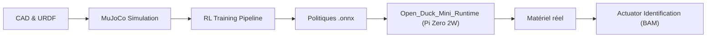

# apirrone/Open_Duck_Mini

> Hub de ressources pour construire un mini droïde bipède inspiré de Disney, de la CAO à l'apprentissage par renforcement.

## Le problème
Un robot bipède bon marché exige conception, simulation, entraînement de politiques et déploiement embarqué, dispersés dans des dépôts.

## Ce que ça fait vraiment
Centralise CAO (Onshape, URDF), simulation MuJoCo, entraînement RL (migration vers MuJoCo Playground), identification d'actionneurs (BAM de Rhoban), guides d'impression et d'assemblage, BOM. La politique ONNX tourne sur un Raspberry Pi Zero 2W via un dépôt runtime séparé. Le README admet de nombreux scripts non documentés.

## Comment c'est branché


## Essayer
```bash
# Aucune commande dans le README : renvois vers guides d'impression, d'assemblage,
# dépôt runtime et document d'entraînement.
```

## Coût et pièges
Coût matériel annoncé sous 400 $ (BOM). Entraînement RL nécessitant du calcul GPU ; assemblage « incomplet » selon le README ; document CAO signalé obsolète.

## Ce que ce n'est pas
Pas une bibliothèque installable : dépôt de travail. Dernier push en janvier 2026, activité en baisse.

## Alternatives
- MuJoCo Playground : cible de la migration RL.
- BAM (Rhoban) : identification d'actionneurs.

## Pour toi
À surveiller : pertinent en sim2real et RL avec MuJoCo, mais documentation partielle et projet de loisir matériel.

