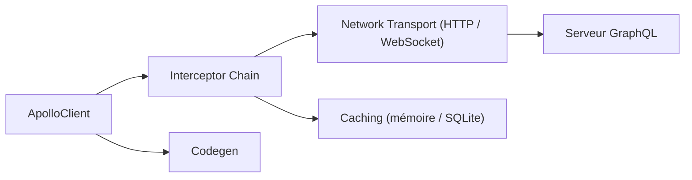

# apollographql/apollo-ios

> Client GraphQL typé en Swift pour applications Apple, avec cache et génération de code.

## Le problème
Consommer une API GraphQL en Swift oblige à écrire à la main modèles et cache pour les réponses.

## Ce que ça fait vraiment
Génère des modèles Swift à partir du schéma, exécute requêtes, mutations et abonnements via une chaîne d'intercepteurs, et met en cache en mémoire ou dans SQLite. Modules : Apollo, ApolloAPI, ApolloSQLite, ApolloWebSocket, ApolloTestSupport. Installation par Swift Package Manager.

## Comment c'est branché


## Essayer
```swift
dependencies: [
    .package(
        url: "https://github.com/apollographql/apollo-ios.git",
        .upToNextMajor(from: "2.0.0")
    ),
],
```

## Coût et pièges
Gratuit ; nécessite un serveur GraphQL existant. Le README fait aussi la promotion de la plateforme Apollo (GraphOS, Router), à part.

## Ce que ce n'est pas
Pas un serveur GraphQL ni un outil d'IA. Le README mentionne des événements datés de 2025.

## Alternatives
- Aucune alternative citée dans le README.

## Pour toi
À ignorer : bibliothèque mobile Swift, hors périmètre data/IA/MLOps.

