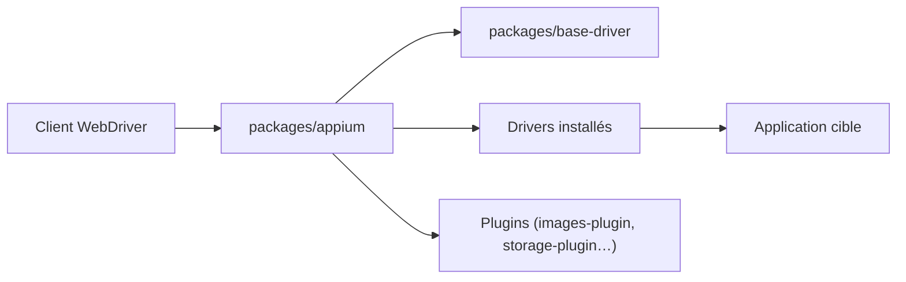

# appium/appium

> Serveur d'automatisation de tests mobiles et bureau via WebDriver, pour les équipes QA multi-plateformes.

## Le problème
Tester une application native iOS ou Android impose sinon un outil et un langage par plateforme (XCUITest, UiAutomator, Espresso).

## Ce que ça fait vraiment
Un serveur Node modulaire (monorepo Lerna) qui expose le protocole WebDriver. Le serveur seul n'automatise rien : on installe des drivers par plateforme (`appium driver install`) et éventuellement des plugins. Les clients existent en Java, Python, Ruby et C#. On écrit les tests dans le langage et le framework de son choix, sans recompiler l'application.

## Comment c'est branché


## Essayer
```bash
npm i -g appium
appium driver install <driver-name>
appium driver list --installed
appium server
appium --use-plugins=<plugin-name>
```

## Coût et pièges
Gratuit. Node et npm requis (autres gestionnaires non supportés). Chaque driver a ses propres prérequis, à lire dans sa doc. Avec Appium 1, le README demande une désinstallation complète avant.

## Ce que ce n'est pas
Ce n'est pas un framework de tests : il ne fournit ni assertions ni exécuteur. Il n'a aucun rapport avec les modèles ou les données.

## Alternatives
Aucune alternative citée dans le README (XCUITest, UiAutomator et Espresso sont cités comme les outils natifs qu'il évite).

## Pour toi
Ignorer : outil de QA mobile sans lien avec le profil data / IA / MLOps, sauf projet d'app mobile à tester.

