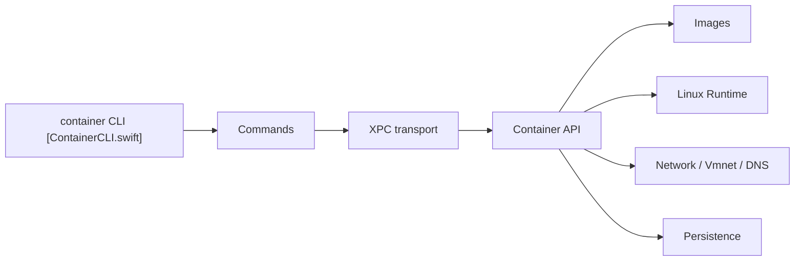

# apple/container

> Outil en Swift pour exécuter des conteneurs Linux comme machines virtuelles légères sur Mac Apple silicon.

## Le problème
Lancer des conteneurs Linux sur Mac passe d'habitude par une VM partagée lourde.

## Ce que ça fait vraiment
Une CLI fine qui parle en XPC à des services privilégiés (API conteneurs, images, réseau, runtime Linux, machines). Chaque conteneur tourne dans sa propre VM légère, avec images OCI standard (pull, build, push). Le package Containerization gère le bas niveau ; des plugins étendent les services.

## Comment c'est branché


## Essayer
```bash
container system start
container run --rm alpine echo hello
container system stop
/usr/local/bin/update-container.sh
/usr/local/bin/uninstall-container.sh -k
```

## Coût et pièges
Exige un Mac Apple silicon et macOS 26 ; les anciennes versions ne sont pas prises en charge. L'installeur demande le mot de passe administrateur (`/usr/local`). Versions non sémantiques, fonctions expérimentales (`k8s`) sans garantie.

## Ce que ce n'est pas
Ce n'est pas un remplaçant de Docker sur Linux ou Windows, ni un orchestrateur. Le README ne documente aucun accès GPU aux conteneurs.

## Alternatives
Aucune alternative nommée dans le README.

## Pour toi
À surveiller : intéressant si tu développes sur Mac pour tester des images, mais dépendant de macOS 26 et sans GPU documenté.

