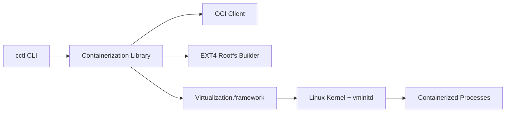

# apple/containerization

> Paquet Swift pour lancer des conteneurs Linux, chacun dans sa propre machine virtuelle légère, sur Mac Apple silicon.

## Le problème
Exécuter des conteneurs Linux sur macOS passe d'ordinaire par une grosse machine virtuelle partagée ; Apple veut une isolation par conteneur.

## Ce que ça fait vraiment
Fournit des API pour gérer les images OCI et les registres, créer des systèmes de fichiers ext4, parler à Netlink, lancer des machines virtuelles légères avec un noyau Linux optimisé et Rosetta 2. Chaque conteneur tourne dans sa VM avec sa propre adresse IP ; `vminitd`, un init minimal, expose une API gRPC sur vsock. Un backend Linux existe (cloud-hypervisor + KVM). Version 0.1.0, stabilité de code non garantie entre versions mineures.

## Comment c'est branché


## Essayer
```bash
make all
make test integration
make fetch-default-kernel
make protos
make docs
```

## Coût et pièges
Gratuit. Exige un Mac Apple silicon, macOS 26 et Xcode 26, ainsi que la CLI `container` pour compiler le guest. Un noyau doit être fourni ou compilé.

## Ce que ce n'est pas
Ce n'est pas la CLI pour lancer des conteneurs : celle-ci se trouve dans apple/container.

## Alternatives
apple/container, dépôt dédié aux binaires en ligne de commande.

## Pour toi
À surveiller : intéressant pour développer sur Mac sans Docker Desktop, mais très récent et limité à Apple silicon ; sans utilité pour du MLOps sur serveur Linux.

