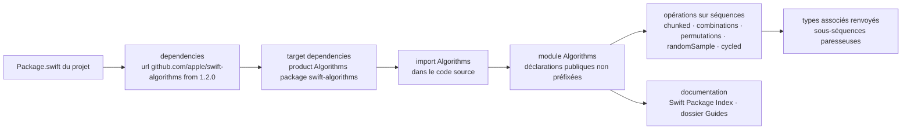

# apple/swift-algorithms

> **A Swift package of sequence and collection operations, for anyone writing Swift day to day.**

## The problem

The Swift standard library does not ship the everyday operations for chunking, combining,
permuting or randomly sampling a collection. Every project rewrites them by hand, with the
index mistakes and edge cases that entails, and with no guarantee they will survive the next
language release.

## What it actually does

The package adds sequence and collection operations plus the related types they return. The
README lists: cycling over a collection's elements, finding combinations and permutations,
creating a random sample, "and more".

The only group it details is the "chunking" methods, which break a collection into consecutive
subsequences. Two forms are shown:

- `chunked(by:)` tests adjacent elements to find the breaking point — the README example splits
  `[10, 20, 30, 10, 40, 40, 10, 20]` into ascending runs.
- `chunked(on:)` watches for a change in a transformation of each successive value — the example
  groups a list of names by first letter.

The rest of the surface is not enumerated here: the README points to the API documentation on
Swift Package Index, the swift.org announcement and the repository's `Guides` folder. One fact
matters as much as the code: the package is declared source stable, versioned with SemVer, and
only a new major version may break the public API.

## How it is wired

No code-derived diagram exists for this repository; the graph below is reconstructed from the
README alone, following the SwiftPM integration steps it describes.



In practice there is no executable and no service: the only plumbing is the SwiftPM dependency
declaration, then an `import` that makes the methods available on standard library types.

## Trying it

The README documents **no shell command** — no build, no test, no command-line install. It only
gives the lines to paste into `Package.swift`:

```swift
.package(url: "https://github.com/apple/swift-algorithms", from: "1.2.0"),
```

```swift
.target(name: "<target>", dependencies: [
    .product(name: "Algorithms", package: "swift-algorithms"),
]),
```

Then, in your source: `import Algorithms`.

## Cost and traps

Nothing to pay, no API key, no third-party service, no account: it is a source dependency built
with your project. The real cost sits elsewhere, and the README states it: future versions of
the package may require a more recent Swift toolchain release, and that requirement will only
bump the *minor* version. A version bump that looks harmless under SemVer can therefore force a
toolchain upgrade in CI. Second trap: only non-underscored `public` declarations in the
`Algorithms` module count as public API; everything else may change in any release, patch
releases included.

## What it is not

It is not an algorithms library in the "sorting, graphs, data structures" sense: the README only
covers sequence and collection operations. It is not a tool or an application either — there is
nothing to run. It is not part of the standard library: despite the Apple name and the swift.org
announcement, it is a package you declare as a dependency, with its own release cycle. Finally,
the README is not API documentation: it shows two methods over a surface it openly does not
inventory — hence the "insufficient material" flag, which is about the README, not the code.

## Alternatives

The README names no competing project, and no catalogue neighbours were supplied: no comparable
alternative in the catalogue. The only pointers are internal to the official Swift ecosystem —
the API documentation on Swift Package Index, the swift.org announcement, and the repository's
`Guides` folder, which holds API proposals and reads as design discussion rather than as a
replacement.

## For you

Little direct value for a data / AI / MLOps stack, which lives in Python: the package does not
leave the Swift ecosystem. It earns a look in one case only — work on Apple devices (Core ML,
signal processing, an iOS app around a model) where you handle collections and would otherwise
hand-roll these operations. There, the source stability guarantee and Apple's stewardship make
it a dependency you can take without second thoughts.
