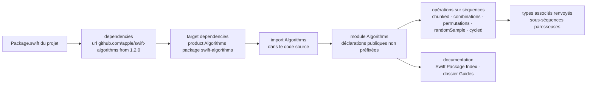

# apple/swift-algorithms

> **Paquet Swift d'opérations sur séquences et collections, pour qui écrit du Swift au quotidien.**

## Le problème

La bibliothèque standard de Swift ne fournit pas les opérations courantes de découpage,
de combinaison, de permutation ou d'échantillonnage sur une collection. Chaque projet les
réécrit à la main, avec les erreurs d'indices et les cas limites que cela suppose, et sans
garantie de stabilité d'une version du langage à l'autre.

## Ce que ça fait vraiment

Le paquet ajoute des opérations sur les séquences et les collections, ainsi que les types
associés qu'elles renvoient. Le README énumère : parcourir en boucle les éléments d'une
collection (*cycle*), produire des combinaisons et des permutations, tirer un échantillon
aléatoire, « et plus ».

Le seul groupe détaillé est celui des méthodes de *chunking*, qui découpent une collection en
sous-séquences consécutives. Deux formes sont montrées :

- `chunked(by:)` compare les éléments adjacents pour trouver le point de rupture — l'exemple
  du README sépare `[10, 20, 30, 10, 40, 40, 10, 20]` en suites croissantes.
- `chunked(on:)` surveille le changement d'une transformation de chaque valeur successive —
  l'exemple groupe une liste de prénoms par première lettre.

Le reste de la surface n'est pas listé ici : le README renvoie à la documentation d'API sur
Swift Package Index, à l'annonce sur swift.org et au dossier `Guides` du dépôt. Ce qui compte
autant que le code : le paquet est déclaré *source stable*, versionné en SemVer, et seule une
version majeure peut casser l'API publique.

## Comment c'est branché

Aucun diagramme tiré du code n'existe pour ce dépôt ; ce schéma est reconstruit depuis le seul
README, à partir de la procédure d'intégration SwiftPM qu'il décrit.



En pratique il n'y a pas d'exécutable ni de service : la seule « plomberie » est la déclaration
de dépendance SwiftPM, puis un `import` qui rend les méthodes disponibles sur les types de la
bibliothèque standard.

## Essayer

Le README ne documente **aucune commande shell** — ni build, ni test, ni installation en ligne
de commande. Il donne uniquement les lignes à recopier dans `Package.swift` :

```swift
.package(url: "https://github.com/apple/swift-algorithms", from: "1.2.0"),
```

```swift
.target(name: "<target>", dependencies: [
    .product(name: "Algorithms", package: "swift-algorithms"),
]),
```

Puis, dans le code : `import Algorithms`.

## Coût et pièges

Rien à payer, aucune clé d'API, aucun service tiers, aucun compte : c'est une dépendance source
compilée avec le projet. Le coût réel est ailleurs, et le README le dit explicitement : les
futures versions du paquet peuvent exiger une version plus récente de la chaîne d'outils Swift,
et cette exigence n'arrivera que par un incrément *mineur* de version. Autrement dit, une montée
de version anodine côté SemVer peut forcer une mise à jour de toolchain côté CI. Second piège :
seules les déclarations `public` non préfixées d'un souligné du module `Algorithms` font partie
de l'API publique ; tout le reste peut changer, y compris dans une version corrective.

## Ce que ce n'est pas

Ce n'est pas une bibliothèque d'algorithmes au sens « tri, graphes, structures de données » :
le README ne parle que d'opérations sur séquences et collections. Ce n'est pas non plus un outil
ni une application — il n'y a rien à lancer. Ce n'est pas une partie de la bibliothèque standard :
malgré l'étiquette Apple et l'annonce sur swift.org, c'est un paquet à déclarer en dépendance,
avec son propre cycle de versions. Enfin, le README n'est pas une documentation d'API : il montre
deux méthodes sur une surface dont il admet lui-même ne pas faire l'inventaire — d'où l'alerte
« matière insuffisante », qui porte sur le README, pas sur le code.

## Alternatives

Le README ne nomme aucun projet concurrent, et aucun voisin de catalogue n'a été fourni :
aucune alternative comparable dans le catalogue. Les seuls renvois sont internes à l'écosystème
Swift officiel — la documentation d'API sur Swift Package Index, l'annonce swift.org et le
dossier `Guides` du dépôt, qui contient les propositions d'API et sert de discussion de
conception plutôt que de solution de remplacement.

## Pour toi

Peu d'intérêt direct pour une pile data / IA / MLOps, qui vit en Python : le paquet ne sort pas
de l'écosystème Swift. Il vaut le détour dans un seul cas — un travail sur appareil Apple (Core
ML, traitement de signal, application iOS autour d'un modèle) où l'on manipule des collections
et où l'on réécrirait sinon ces opérations à la main. Dans ce cas, la garantie de stabilité de
source et la gouvernance Apple en font une dépendance sans état d'âme.
