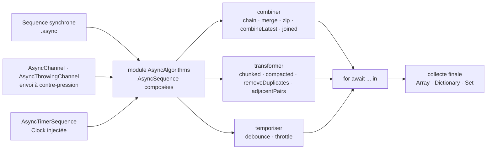

# apple/swift-async-algorithms

> **The missing operators on Swift's `AsyncSequence`: combining, chunking and timing asynchronous streams.**

## The problem

Swift 5.5 brought `AsyncSequence`, the `for await` loop and the asynchronous counterparts of
`map` and `filter`, and nothing beyond that. As soon as several streams must be combined —
take whichever fires first, pair two sources, keep one value after a quiet period — you write
the iterator yourself. The README says exactly this: multi-input operations, `zip` foremost,
are "surprisingly complex to implement", full of subtle behaviours and edge cases, and every
application reimplements them with its own bugs.

## What it actually does

The package ships the `AsyncAlgorithms` module, a catalogue of algorithms over `AsyncSequence`,
grouped by family in the README:

- **Combining**: `chain(_:...)` (concatenation), `combineLatest(_:...)` (a tuple refreshed
  whenever any source emits), `merge(_:...)`, `zip(_:...)`, `joined(separator:)`.
- **Creating**: `.async` to lift a synchronous `Sequence`, plus `AsyncChannel` and
  `AsyncThrowingChannel`, sequences with back-pressure sending semantics, the latter able to
  emit failures.
- **Time**: `debounce(for:tolerance:clock:)` (emit after a quiescence period),
  `throttle(for:clock:reducing:)` (enforce a minimum interval between events) and
  `AsyncTimerSequence` (emit now at a given interval). All three take a `clock` parameter —
  time is injected, therefore testable.
- **Transforming**: `adjacentPairs()`, `chunks(...)` / `chunked(...)`, `compacted()`,
  `removeDuplicates()`, `interspersed(with:)`.
- **Leaving the stream**: initialisers on `RangeReplaceableCollection`, `Dictionary` (including
  `init(grouping:by:)`) and `SetAlgebra` that consume a whole asynchronous sequence.
- **One optimised iterator**: `AsyncBufferedByteIterator`, for byte sequences derived from
  asynchronous read functions.

The README also documents a per-algorithm table of *effects*: which ones throw, rethrow or
never throw, and which `Sendable` conformances are conditional on the composed parts. That is
the part hand-rolled reimplementations usually get wrong.

## How it is wired



No code-derived diagram exists for this repository: the graph is reconstructed from the README
alone, following the families it lists. The point to take away is that there is no central
engine — everything is an `AsyncSequence` wrapping another one, and composition always ends in
a `for await` loop or a collection initialiser.

## Trying it

The README gives no runnable usage example, only how to add the dependency in `Package.swift`:

```swift
.package(url: "https://github.com/apple/swift-async-algorithms", from: "1.0.0"),
```

```swift
.target(name: "<target>", dependencies: [
    .product(name: "AsyncAlgorithms", package: "swift-async-algorithms"),
]),
```

Then `import AsyncAlgorithms` in your source. To build and test the package itself, from the
`swift-async-algorithms` directory:

```bash
swift build
swift test
```

On Linux the README first asks you to download the most recent development toolchain for your
distribution and decompress the archive somewhere the `swift` executable lands in `$PATH`.

## Cost and traps

- **Free, Apache-2.0 per the catalogue, no key and no third-party service**: the only cost is
  the Swift toolchain.
- **Explicit tooling constraint**: the README warns the package requires Xcode 14 on macOS
  hosts, earlier versions not carrying the required Swift version. The stated foundation is
  `AsyncSequence` from Swift 5.5.
- **Source stability is a goal, not a fact.** The README aims for it "as soon as possible",
  restricts the public API to non-underscored `public` declarations in the `AsyncAlgorithms`
  module, warns everything else may change in any release including patch releases, and that
  "future minor versions of the package may introduce changes to these rules".
- **Forced toolchain upgrades**: the README states new versions may require clients to move to
  a more recent Swift toolchain, and that such a requirement will only bump the minor version.
  A minor update can therefore cost a toolchain migration.
- **Flag kept: stale last commit.** Nothing in the README dates the activity, but its material
  is frozen at the Xcode 14 / Swift 5.5 era and still describes version 1.0 in the future
  tense. Check the repository before depending on it — it is the only defensible signal here,
  the rest of the file being clean.

## What it is not

- **It is not Combine, nor a Combine replacement.** The README never mentions Apple's framework:
  no `Publisher`, no `Subscriber`, no documented interoperability operators. Everything stays
  in `async/await` and structured concurrency.
- **It is not a language or standard-library extension**: it is a SwiftPM package to add and
  import, whose public API does not carry stdlib guarantees.
- **It is not a scheduler or a task queue**: it composes sequences of values over time; it
  handles neither core scheduling, nor persistence, nor error recovery beyond the documented
  `throws`/`rethrows` effects.
- **It is not a tutorial**: the README is an index of links to the repository's DocC guides; it
  contains no usage code at all, only the dependency snippets.

## Alternatives

| | When to prefer it |
|---|---|
| **apple/swift-evolution (proposal 0298, `AsyncSequence`)** | The only related repository named in the README: the foundation shipped inside Swift 5.5. Enough if you only need `for await`, `map` and `filter` over a single stream — no dependency required. Move to `swift-async-algorithms` as soon as you must combine several sources or reason about time. |

The catalogue row lists no neighbours for this repository (empty column), so there is no other
comparable alternative in the catalogue: the other entries cover Python machine-learning tools,
unrelated to Swift concurrency.

## For you

Skip it on a data / AI / MLOps profile: that value chain is Python, and this package only pays
off inside a Swift project. The one reason to remember it is the day an in-house iOS or macOS
app has to consume an inference stream — `debounce`, `throttle` and back-pressured
`AsyncChannel` would remove a lot of fragile code. The design choice of injecting a `Clock`
into the time operators is worth stealing elsewhere: it is what makes time testable.
