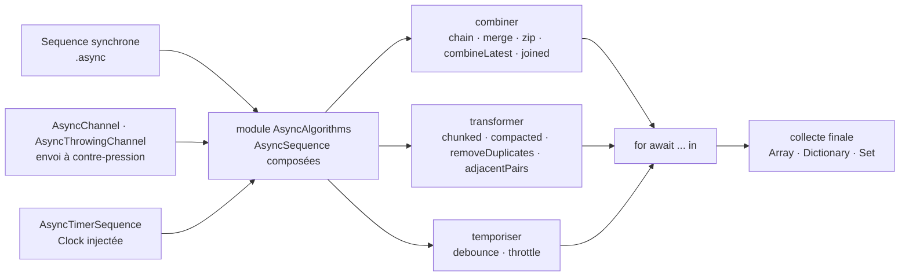

# apple/swift-async-algorithms

> **Les opérateurs manquants sur `AsyncSequence` en Swift : combiner, découper, temporiser des flux asynchrones.**

## Le problème

Swift 5.5 a apporté `AsyncSequence`, la boucle `for await` et l'équivalent asynchrone de `map`
et `filter`, mais rien au-delà. Dès qu'il faut combiner plusieurs flux — attendre le premier
des deux, apparier deux sources, ne garder qu'une valeur après une période de calme — il faut
écrire soi-même l'itérateur. Le README pointe précisément là : ces opérations à plusieurs
entrées, `zip` en tête, sont « surprisingly complex to implement », pleines de comportements
subtils et de cas limites, et chaque application les réimplémente de son côté avec ses propres
bugs.

## Ce que ça fait vraiment

Le paquet livre le module `AsyncAlgorithms`, un catalogue d'algorithmes sur `AsyncSequence`,
rangé par famille dans le README :

- **Combiner** : `chain(_:...)` (concaténation), `combineLatest(_:...)` (tuple remis à jour dès
  qu'une source émet), `merge(_:...)`, `zip(_:...)`, `joined(separator:)`.
- **Créer** : `.async` pour promouvoir une `Sequence` synchrone, et `AsyncChannel` /
  `AsyncThrowingChannel`, des séquences avec sémantique d'envoi à contre-pression, la seconde
  pouvant émettre des erreurs.
- **Le temps** : `debounce(for:tolerance:clock:)` (émettre après une période de quiescence),
  `throttle(for:clock:reducing:)` (intervalle minimum entre deux événements), et
  `AsyncTimerSequence` (émettre l'instant courant à intervalle régulier). Ces trois-là prennent
  une `clock` en paramètre — le temps est injecté, donc testable.
- **Transformer** : `adjacentPairs()`, `chunks(...)` / `chunked(...)`, `compacted()`,
  `removeDuplicates()`, `interspersed(with:)`.
- **Sortir du flux** : des initialiseurs sur `RangeReplaceableCollection`, `Dictionary`
  (dont `init(grouping:by:)`) et `SetAlgebra` qui consomment une séquence asynchrone entière.
- **Un itérateur optimisé** : `AsyncBufferedByteIterator`, pour itérer des octets issus de
  fonctions de lecture asynchrones.

Le README documente aussi une table des *effects* par algorithme : qui `throw`, qui `rethrows`,
qui ne lance pas, et quelles conformités `Sendable` sont conditionnelles à celles des parties
composées. C'est la partie que les réimplémentations maison ratent en général.

## Comment c'est branché



Aucun diagramme tiré du code n'existe pour ce dépôt : ce schéma est reconstruit depuis le seul
README, à partir des familles qu'il énumère. Le point à retenir est qu'il n'y a pas de moteur
central : tout est une `AsyncSequence` qui en enveloppe une autre, et la composition se termine
toujours par une boucle `for await` ou par un initialiseur de collection.

## Essayer

Le README ne donne pas d'exemple d'usage exécutable, seulement l'ajout de la dépendance dans
`Package.swift` :

```swift
.package(url: "https://github.com/apple/swift-async-algorithms", from: "1.0.0"),
```

```swift
.target(name: "<target>", dependencies: [
    .product(name: "AsyncAlgorithms", package: "swift-async-algorithms"),
]),
```

Puis `import AsyncAlgorithms` dans le code source. Pour compiler et tester le paquet lui-même,
depuis le répertoire `swift-async-algorithms` :

```bash
swift build
swift test
```

Sur Linux, le README demande d'abord de télécharger la *development toolchain* la plus récente
de sa distribution et de décompresser l'archive à un endroit où l'exécutable `swift` se trouve
dans le `$PATH`.

## Coût et pièges

- **Gratuit, Apache-2.0 selon le catalogue, aucune clé ni service tiers** : le seul coût est la
  chaîne d'outils Swift.
- **Contrainte d'outillage explicite** : le README avertit que le paquet exige Xcode 14 sur un
  hôte macOS, les versions antérieures ne contenant pas la version de Swift requise. Le socle
  annoncé est `AsyncSequence` de Swift 5.5.
- **La stabilité de source est un objectif, pas un acquis.** Le README dit viser la stabilité
  « as soon as possible », restreint l'API publique aux déclarations `public` non soulignées du
  module `AsyncAlgorithms`, prévient que tout le reste peut changer y compris en version
  corrective, et que « future minor versions of the package may introduce changes to these
  rules ».
- **Montée de version forcée** : le README annonce que de nouvelles versions pourront exiger une
  chaîne d'outils Swift plus récente, et qu'une telle exigence ne vaudra qu'un incrément mineur.
  Une mise à jour mineure peut donc coûter une migration de toolchain.
- **Alerte retenue : `dernier commit ancien`.** Rien dans le README ne date l'activité, mais sa
  matière est figée à l'ère Xcode 14 / Swift 5.5 et au fait que la version 1.0 y est encore
  décrite au futur. À vérifier sur le dépôt avant d'en dépendre — c'est le seul signal
  défendable ici, le reste du dossier étant propre.

## Ce que ce n'est pas

- **Ce n'est pas Combine, ni un remplaçant de Combine.** Le README ne mentionne nulle part le
  framework d'Apple : il n'y a ni `Publisher`, ni `Subscriber`, ni opérateurs d'interopérabilité
  documentés. On reste dans `async/await` et la concurrence structurée.
- **Ce n'est pas une extension du langage ni de la bibliothèque standard** : c'est un paquet
  SwiftPM à ajouter et à importer, dont l'API publique n'a pas les garanties de la stdlib.
- **Ce n'est pas un ordonnanceur ni une file de tâches** : le paquet compose des séquences de
  valeurs dans le temps, il ne gère ni la répartition sur les cœurs, ni la persistance, ni la
  reprise après erreur au-delà des effets `throws`/`rethrows` documentés.
- **Ce n'est pas un tutoriel** : le README est un index de liens vers les guides DocC du dépôt ;
  il ne contient aucun exemple de code d'utilisation, seulement l'ajout de la dépendance.

## Alternatives

| | Quand le préférer |
|---|---|
| **apple/swift-evolution (proposal 0298, `AsyncSequence`)** | Seul dépôt apparenté nommé dans le README : c'est le socle intégré à Swift 5.5. Suffisant si l'on se contente de `for await`, `map` et `filter` sur un seul flux — inutile d'ajouter une dépendance. Passer à `swift-async-algorithms` dès qu'il faut combiner plusieurs sources ou raisonner sur le temps. |

La ligne du catalogue ne propose aucun voisin pour ce dépôt (colonne vide), il n'y a donc pas
d'autre alternative comparable dans le catalogue : les autres fiches portent sur des outils
Python d'apprentissage automatique, sans rapport avec la concurrence en Swift.

## Pour toi

À ignorer pour un profil data / IA / MLOps : la chaîne de valeur y est en Python, et ce paquet
ne sert que dans un projet Swift. La seule raison de le garder en tête est le jour où une appli
iOS ou macOS maison doit consommer un flux d'inférence — `debounce`, `throttle` et
`AsyncChannel` avec contre-pression y feraient gagner du code fragile. Le parti pris
d'injecter une `Clock` dans les opérateurs temporels reste, lui, une bonne idée à voler
ailleurs : c'est ce qui rend le temps testable.
