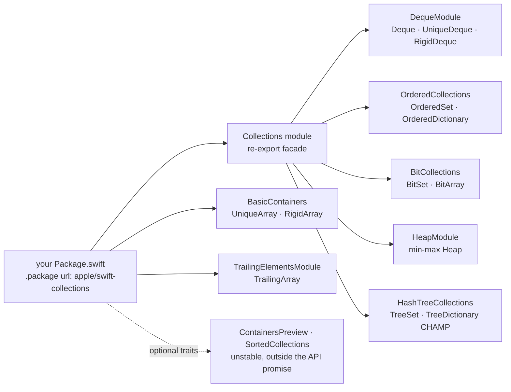

# apple/swift-collections

> **The data structures missing from the Swift standard library, shipped by Apple as one SwiftPM package.**

## The problem

Swift's standard library offers `Array`, `Set` and `Dictionary` and little else: no
double-ended queue, no heap, no insertion-ordered set, no bit map. Every project ends up
rewriting its own barely-tested version, or pulling in a third-party dependency whose source
stability nobody guarantees.

## What it actually does

The package ships concrete implementations, split into thematic modules you import separately
— or all at once through the `Collections` module, which re-exports the common ones.

- `DequeModule`: `Deque`, a ring-buffer double-ended queue with value semantics and
  copy-on-write, plus the fixed-capacity `RigidDeque` and the noncopyable `UniqueDeque`.
- `OrderedCollections`: `OrderedSet` and `OrderedDictionary`, preserving insertion order.
- `BitCollections`: `BitSet` and `BitArray`, described as leaner implementations of `Set<Int>`
  and `Array<Bool>`.
- `HeapModule`: `Heap`, an array-backed min-max heap usable as a priority queue.
- `HashTreeCollections`: `TreeSet` and `TreeDictionary`, persistent CHAMP hashed collections
  where mutating a shared copy does not duplicate the unchanged parts.
- `BasicContainers` and `TrailingElementsModule`: ownership-aware rewrites (`UniqueArray`,
  `RigidArray`) and `TrailingArray` for C interop with header-plus-buffer layouts.

Everything else — B-tree sorted collections, the `Container` / `Producer` / `Drain` protocols,
Robin Hood hashed containers for noncopyable elements — exists but sits behind package traits
(`UnstableContainersPreview`, `UnstableHashedContainers`, `UnstableSortedCollections`) and is
explicitly excluded from the public API.

## How it is wired

No code-derived diagram exists for this repository: the graph below is reconstructed from the
modules the README lists.



## Trying it

The README documents **no shell command at all**: no `git clone`, no `swift build`, no
`swift test`. The only installation procedure given is a SwiftPM dependency declaration, in
Swift rather than bash — reproduced here as-is, after which the command block is just that
statement of fact.

```swift
// swift-tools-version:6.3
import PackageDescription

let package = Package(
  name: "MyPackage",
  dependencies: [
    .package(
      url: "https://github.com/apple/swift-collections.git",
      .upToNextMinor(from: "1.6.0") // or `.upToNextMajor`
    )
  ],
  targets: [
    .target(
      name: "MyTarget",
      dependencies: [
        .product(name: "Collections", package: "swift-collections")
      ]
    )
  ]
)
```

```bash
# The README provides no command line: nothing to copy here.
# Installation happens only through the Package.swift above,
# then `import Collections` in your source.
```

## Cost and gotchas

- **Free, no API key, no third-party service, no GPU**: it is source code you compile
  yourself, with no documented network call.
- **The real cost is the toolchain version.** The README tabulates it: 1.3.x through 1.6.x
  require Swift >= 6.0.3 and Xcode >= 16.2. Any minor release may raise that floor; only patch
  releases promise not to. Some features go further — `RigidArray` needs Swift 6.2.
- **The experimental traits are not API.** Anything opened by `UnstableContainersPreview`,
  `UnstableHashedContainers` or `UnstableSortedCollections` can change incompatibly or vanish
  in any release, patch releases included. The README even warns those constructs will be
  removed once the standard library absorbs them.
- **The repository's CMake and Xcode configurations are for internal Swift project use** and
  may be removed without notice: the compatibility promise covers SwiftPM consumption only.
- **Branch policy matters before contributing**: a fix must start from the branch of the
  earliest release it should ship in, and propagation towards `main` is done by hand.

## What it is not

- **It is not the standard library.** It is an external, separately versioned dependency, and
  part of its content is a proving ground for future Swift Evolution proposals — code meant to
  move elsewhere.
- **It is not an exhaustive data-structure catalogue**: no graphs, no stable search trees, no
  tries. Sorted collections stay behind an unstable trait, and the README states no major new
  structure is planned until the noncopyable-types refactor is finished.
- **It is not usable outside the Swift ecosystem**: no bindings for other languages, and no
  relevance to a Python or JavaScript stack.

## Alternatives

No comparable alternative in the catalogue: the README names no competing repository, and no
neighbours were supplied with this slug. The only comparison the README makes is with the
Swift standard library itself, which this package positions itself as completing — and, for
the experimental types, as feeding.

## For you

Worth adopting — but only if Swift is in scope: a macOS or iOS tool, a server-side service,
embedded code. For a data / AI / MLOps profile living in Python it changes nothing day to day;
keep it filed as Apple's answer to "where is the priority queue in Swift?", and as a
versioning discipline worth copying (explicitly defined public API, traits to fence off the
unstable, a version-to-toolchain table).
