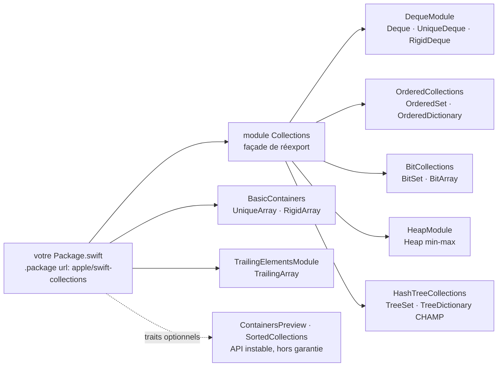

# apple/swift-collections

> **Structures de données manquantes de la bibliothèque standard Swift, publiées par Apple en un paquet SwiftPM.**

## Le problème

La bibliothèque standard de Swift ne fournit que `Array`, `Set` et `Dictionary` : ni file à
deux bouts, ni tas, ni ensemble ordonné, ni carte de bits. Chaque projet finit par réécrire sa
propre version, non testée et rarement optimale, ou par tirer une dépendance tierce dont la
stabilité de source n'est garantie par personne.

## Ce que ça fait vraiment

Le paquet livre des implémentations concrètes, réparties en modules thématiques que l'on
importe séparément — ou en bloc via le module `Collections`, qui réexporte les plus courantes.

- `DequeModule` : `Deque` (file à deux bouts sur tampon circulaire, sémantique de valeur avec
  copie à l'écriture), plus les variantes `UniqueDeque` et `RigidDeque` à capacité fixe.
- `OrderedCollections` : `OrderedSet` et `OrderedDictionary`, qui conservent l'ordre d'insertion.
- `BitCollections` : `BitSet` et `BitArray`, présentés comme des implémentations plus économes
  que `Set<Int>` et `Array<Bool>`.
- `HeapModule` : `Heap`, un tas min-max sur tableau, utilisable comme file de priorité.
- `HashTreeCollections` : `TreeSet` et `TreeDictionary`, collections hachées persistantes en
  CHAMP, où muter une copie partagée ne duplique pas les parties inchangées.
- `BasicContainers` et `TrailingElementsModule` : réimplémentations conscientes de la propriété
  (`UniqueArray`, `RigidArray`) et `TrailingArray` pour l'interopérabilité C en-tête + tampon.

Le reste — conteneurs triés en arbre B, protocoles `Container`, `Producer`, `Drain`, ensembles
et dictionnaires Robin Hood non copiables — existe mais est fermé derrière des *package traits*
(`UnstableContainersPreview`, `UnstableHashedContainers`, `UnstableSortedCollections`) et
déclaré hors API publique.

## Comment c'est branché

Aucun diagramme tiré du code n'est disponible pour ce dépôt : le schéma ci-dessous est
reconstruit depuis les seuls modules que le README énumère.



## Essayer

Le README ne documente **aucune commande shell** : ni `git clone`, ni `swift build`, ni
`swift test`. La seule procédure d'installation donnée est une déclaration de dépendance
SwiftPM, en Swift et non en bash — la voici telle quelle, puis le bloc de commandes se réduit
à ce constat.

```swift
// swift-tools-version:6.3
import PackageDescription

let package = Package(
  name: "MyPackage",
  dependencies: [
    .package(
      url: "https://github.com/apple/swift-collections.git",
      .upToNextMinor(from: "1.6.0") // or `.upToNextMajor`
    )
  ],
  targets: [
    .target(
      name: "MyTarget",
      dependencies: [
        .product(name: "Collections", package: "swift-collections")
      ]
    )
  ]
)
```

```bash
# Le README ne fournit aucune ligne de commande : rien à copier ici.
# L'installation passe uniquement par le Package.swift ci-dessus,
# puis par `import Collections` dans le code source.
```

## Coût et pièges

- **Gratuit, pas de clé d'API, pas de service tiers, pas de GPU** : c'est du code source
  compilé chez soi, sans appel réseau documenté.
- **Le vrai coût est la version de la chaîne d'outils.** Le README en fait un tableau : 1.3.x à
  1.6.x exigent Swift ≥ 6.0.3 et Xcode ≥ 16.2. Toute version mineure du paquet peut relever ce
  plancher ; seuls les correctifs s'y engagent. Certaines fonctions vont plus loin —
  `RigidArray` réclame Swift 6.2.
- **Les traits expérimentaux ne sont pas de l'API.** Tout ce qu'ouvrent
  `UnstableContainersPreview`, `UnstableHashedContainers` et `UnstableSortedCollections` peut
  changer de façon incompatible ou disparaître dans n'importe quelle version, y compris un
  correctif. Le README prévient même que ces constructions seront retirées du paquet une fois
  absorbées par la bibliothèque standard.
- **Les configurations CMake et Xcode du dépôt sont réservées à un usage interne au projet
  Swift** et peuvent être supprimées sans préavis : la promesse de compatibilité ne vaut que
  pour l'usage en paquet SwiftPM.
- **Gouvernance de branches à connaître avant de contribuer** : un correctif doit partir de la
  branche de la plus ancienne version concernée, la propagation vers `main` étant manuelle.

## Ce que ce n'est pas

- **Ce n'est pas la bibliothèque standard.** C'est une dépendance externe à ajouter, versionnée
  séparément, et dont une partie du contenu est un banc d'essai pour de futures propositions
  Swift Evolution — c'est-à-dire du code destiné à migrer ailleurs.
- **Ce n'est pas un catalogue exhaustif de structures de données** : pas de graphes, pas
  d'arbres de recherche stables, pas de tries. Les collections triées restent derrière un trait
  instable, et le README annonce qu'aucune nouvelle structure majeure n'est prévue tant que le
  chantier des types non copiables n'est pas terminé.
- **Ce n'est pas utilisable hors de l'écosystème Swift** : aucun binding pour un autre langage,
  aucune pertinence pour une pile Python ou JavaScript.

## Alternatives

Aucune alternative comparable dans le catalogue : le README ne nomme aucun autre dépôt
concurrent, et aucun voisin n'a été fourni avec ce slug. Le seul point de comparaison cité par
le README est la bibliothèque standard de Swift elle-même, dont ce paquet se présente comme le
complément — et, pour les types expérimentaux, comme l'antichambre.

## Pour toi

À adopter — mais seulement si du Swift entre dans ton périmètre : outil macOS ou iOS, service
côté serveur, code embarqué. Pour un profil data / IA / MLOps travaillant en Python, ça ne
change rien au quotidien ; garde-le en mémoire comme la réponse d'Apple à « où est la file de
priorité en Swift ? », et comme un exemple de discipline de versionnement à copier (API
publique définie explicitement, traits pour isoler l'instable, tableau version-outillage).
