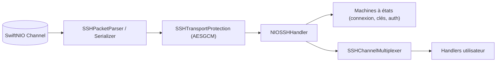

# apple/swift-nio-ssh

> Implémentation programmatique du protocole SSH sur SwiftNIO, pour bâtir clients et serveurs SSH en Swift.

## Le problème
Piloter des commandes distantes ou du transfert de ports depuis un service Swift oblige à lancer un client `ssh` en sous-processus.

## Ce que ça fait vraiment
Fournit `NIOSSHHandler`, un gestionnaire SwiftNIO qui implémente SSH : échange de clés, authentification par délégués, canaux enfants (`session`, `directTCPIP`, `forwardedTCPIP`), redirections de ports. Plus proche de libssh2 que d'OpenSSH, il ne livre pas de client ou serveur de production, seulement des exemples et un testeur de performance.

## Comment c'est branché

## Essayer
Ajouter une dépendance SwiftPM : le README ne fournit pas de commande. Réglage recommandé : `channel.setOption(ChannelOptions.allowRemoteHalfClosure, true)`.

## Coût et pièges
Gratuit. Les versions récentes exigent Swift 6.1. Sans demi-fermeture activée, les canaux enfants se comportent de façon inattendue.

## Ce que ce n'est pas
Ce n'est pas un client ou serveur SSH prêt à l'emploi ; il faut écrire la logique d'authentification et de canaux.

## Alternatives
- libssh2 : comparaison de cas d'usage.
- OpenSSH : le README l'oppose en tant qu'outil complet.

## Pour toi
À ignorer : brique Swift bas niveau, sans usage pour un profil data/IA/MLOps hors développement Swift serveur.

