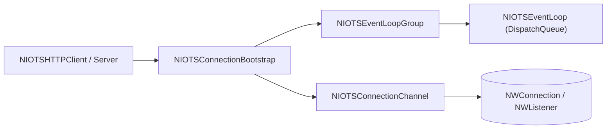

# apple/swift-nio-transport-services

> Extension de SwiftNIO qui utilise Network.framework et Dispatch pour un réseau natif sur plateformes Apple.

## Le problème
Sur Apple, SwiftNIO utilise des sockets POSIX et ignore les atouts de Network.framework (attente de route, proxy, VPN).

## Ce que ça fait vraiment
Fournit une `EventLoop` et un `EventLoopGroup` alternatifs, des canaux (connexion, écoute, datagramme) et des bootstraps s'appuyant sur `NWConnection` et `NWListener`. Une application SwiftNIO existante fonctionne en changeant de boucles d'événements et de bootstraps. Deux exécutables d'exemple (client et serveur HTTP) sont inclus.

## Comment c'est branché


## Essayer
```swift
.package(url: "https://github.com/apple/swift-nio-transport-services.git", from: "1.13.0")
```
Puis ajouter le module `NIOTransportServices` à la cible.

## Coût et pièges
Gratuit ; nécessite `swift-nio`, un système Apple avec Network.framework et Swift 6.1 pour les versions récentes.

## Ce que ce n'est pas
Ce n'est pas un remplacement de SwiftNIO : c'est une extension réservée aux plateformes Apple.

## Alternatives
Le README ne cite aucune alternative (la référence implicite est le SwiftNIO standard).

## Pour toi
À ignorer : brique réseau Swift bas niveau, sans usage pour un profil data/IA/MLOps.

