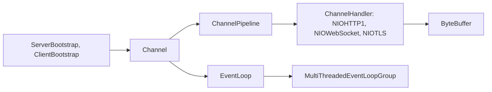

# apple/swift-nio

> Framework réseau asynchrone piloté par événements pour Swift, comparable à Netty, pour serveurs et clients de protocoles.

## Le problème
Un modèle « un thread par connexion » ne tient pas quand un serveur gère un grand nombre de connexions peu actives.

## Ce que ça fait vraiment
Fournit des boucles d'événements (`EventLoop`), des canaux (`Channel`), des pipelines de `ChannelHandler`, des `ByteBuffer` à copie sur écriture et `EventLoopFuture/Promise`. Les modules incluent `NIOCore`, `NIOPosix`, `NIOEmbedded` (tests), `NIOHTTP1`, `NIOWebSocket`, `NIOTLS`. TLS, HTTP/2 et SSH vivent dans d'autres dépôts. Le README précise que la plupart des utilisateurs passeront par un framework web plutôt que par NIO directement.

## Comment c'est branché


## Essayer
```bash
swift run NIOHTTP1Server
swift run TARGET_NAME
```
Pour l'ajouter à un projet : dépendance `.package(url: "https://github.com/apple/swift-nio.git", from: "2.0.0")` dans `Package.swift`.

## Coût et pièges
Gratuit. Les `ChannelHandler` ne doivent pas appeler de code bloquant sans le déporter, sous peine de bloquer tous les canaux de la boucle. Version minimale de Swift en hausse (6.1 depuis la 2.98.0).

## Ce que ce n'est pas
Ce n'est pas un framework web : il fournit des briques de bas niveau. Il ne contient pas TLS ni HTTP/2, qui sont dans d'autres dépôts.

## Alternatives
Netty (Java) est cité comme modèle ; le README renvoie aussi vers des bibliothèques de plus haut niveau (async-http-client, grpc-swift, PostgresNIO).

## Pour toi
Ignorer : brique réseau Swift, hors stack data/IA/MLOps.

