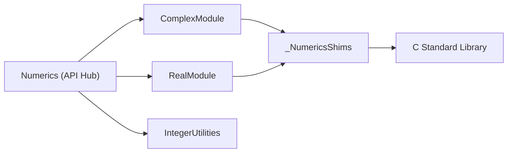

# apple/swift-numerics

> Modules Swift de calcul numérique (nombres complexes, fonctions réelles) proches de la bibliothèque standard.

## Le problème
La bibliothèque standard Swift n'offre ni nombres complexes ni fonctions mathématiques génériques portables.

## Ce que ça fait vraiment
Trois modules : `RealModule` (protocole Real et fonctions élémentaires), `ComplexModule` (`Complex<Double>` etc.), `IntegerUtilities` (sur main seulement, pas encore dans un tag). Un module `Numerics` réexporte l'ensemble. Versionnage sémantique, API publique définie hors éléments soulignés. Extensions futures évoquées : entiers larges, précision arbitraire, tableaux, décimaux.

## Comment c'est branché


## Essayer
```swift
.package(url: "https://github.com/apple/swift-numerics", from: "1.0.0"),
.product(name: "Numerics", package: "swift-numerics"),
```
```swift
import Numerics
```

## Coût et pièges
Gratuit. Les nouvelles versions peuvent exiger une chaîne Swift plus récente (bump mineur).

## Ce que ce n'est pas
Pas un équivalent de NumPy : pas de tableaux ni d'algèbre linéaire aujourd'hui (BLAS/LAPACK évoqués comme possibilité future).

## Alternatives
Aucune alternative nommée dans le README.

## Pour toi
À ignorer : utile seulement si tu écris du Swift numérique ; pour la data, l'écosystème Python reste bien plus outillé.

