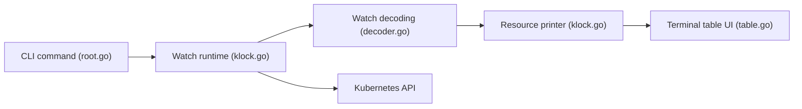

# applejag/kubectl-klock

> Plugin kubectl qui affiche en continu et lisiblement le résultat de `kubectl get --watch`.

## Le problème
`kubectl get pods --watch` empile des lignes illisibles ; `watch kubectl get pods` interroge au lieu de recevoir les mises à jour.

## Ce que ça fait vraiment
Utilise le mécanisme de watch de l'API pour mettre à jour un tableau interactif au même format que `kubectl get` : pagination, filtre, colonne d'âge mise à jour, couleurs, lignes supprimées conservées brièvement, redémarrage si le kubeconfig change.

## Comment c'est branché


## Essayer
```bash
kubectl krew install klock
kubectl klock pods
kubectl klock pods -o wide
kubectl klock pods -A
kubectl klock pods --watch-kubeconfig
```

## Coût et pièges
Gratuit. Accès à un cluster. Licence GPL-3.0. La complétion demande d'ajouter `kubectl_complete-klock` au PATH.

## Ce que ce n'est pas
Pas un tableau de bord ni un outil d'administration : il observe uniquement.

## Alternatives
kubecolor (moteur de couleurs utilisé, non présenté comme alternative).

## Pour toi
À adopter : gain immédiat pour suivre pods et déploiements de tes jobs ML sur Kubernetes, sans coût.

