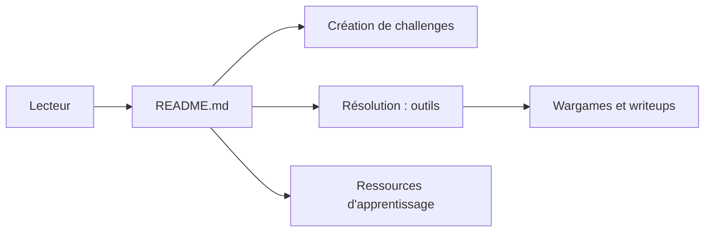

# apsdehal/awesome-ctf

> Liste commentée d'outils, plateformes et ressources pour créer et résoudre des challenges CTF.

## Le problème
Les outils de CTF sont dispersés ; il est difficile de savoir lesquels utiliser par catégorie.

## Ce que ça fait vraiment
Un README Markdown classé en trois blocs : créer (plateformes comme CTFd, FBCTF), résoudre (crypto, forensique, stéganographie, rétro-ingénierie, web, réseau, exploits, force brute) et ressources (systèmes d'exploitation de sécurité, tutoriels, wargames, wikis, collections de writeups). Aucun code applicatif.

## Comment c'est branché


## Essayer
Aucune commande propre au dépôt : lire le README. Le README donne ponctuellement des commandes d'installation d'outils, par exemple :
```bash
apt-get install foremost
pip install sqlmap
```

## Coût et pièges
Gratuit. Certaines plateformes citées sont payantes (PentesterLab). Dernier push en juillet 2024 : des liens peuvent être morts.

## Ce que ce n'est pas
Pas un outil ni un cours : un annuaire de liens, sans garantie d'actualité. L'usage des outils offensifs reste soumis à autorisation.

## Alternatives
- CTF Field Guide (Trail of Bits) : guide cité dans le README pour débuter.
- CTF Time : calendrier des compétitions.

## Pour toi
À ignorer : hors sujet pour data/IA/MLOps, sauf si tu te formes à la sécurité.

