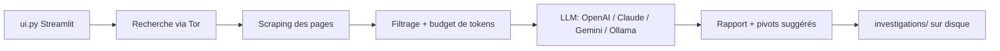

# apurvsinghgautam/robin

> Outil OSINT dark web : recherche via Tor, scraping et synthèse par un LLM, dans une UI Streamlit.

## Le problème
Une recherche sur le dark web produit beaucoup de pages bruitées ; les trier à la main est long,
et un résumé automatique naïf synthétise n'importe quoi, y compris quand il n'y a rien à dire.

## Ce que ça fait vraiment
Sépare nettement recherche, scraping et appel au modèle. Les modèles sont découverts auprès de
chaque fournisseur au démarrage, donc la liste ne périme pas. La barre latérale règle la
profondeur — nombre de résultats filtrés, de pages scrapées, et part de chaque page lue par le
modèle — en affichant le coût en tokens **avant** de lancer. Les questions de suivi sont répondues
à partir des données de l'enquête, sans relancer la recherche, et des pivots suggérés lancent une
nouvelle enquête en un clic. Les enquêtes se sauvegardent sur disque et se rechargent.

## Comment c'est branché


## Essayer
```bash
docker pull apurvsg/robin:latest
docker run --rm -v "$(pwd)/.env:/app/.env" --add-host=host.docker.internal:host-gateway -p 8501:8501 apurvsg/robin:latest
pip install -r requirements.txt
streamlit run ui.py
OLLAMA_HOST=0.0.0.0 ollama serve &
```

## Coût et pièges
Tor doit tourner en tâche de fond (`apt install tor` ou `brew install tor`). Une clé suffit parmi
`OPENAI_API_KEY`, `ANTHROPIC_API_KEY`, `GOOGLE_API_KEY`, `MISTRAL_API_KEY`, `OPENROUTER_API_KEY`,
et la facture de tokens est à toi. Avec Ollama en conteneur, il faut le faire écouter sur
`0.0.0.0` : par défaut il se lie à `127.0.0.1`, inatteignable depuis Docker. Python 3.10+.

## Ce que ce n'est pas
Avertissement explicite du README : usage éducatif et d'investigation licite seulement ; accéder
à certains contenus peut être illégal selon la juridiction, et l'auteur décline toute
responsabilité. Attention aussi aux requêtes sensibles envoyées à des API tierces.

## Alternatives
Aucune alternative nommée dans le README.

## Pour toi
Bon exemple d'architecture RAG budgétée ; l'usage réel demande un cadre légal explicite.
