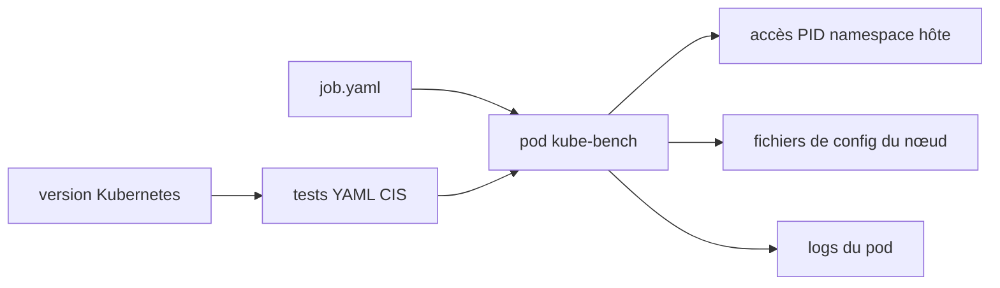

# aquasecurity/kube-bench

> Vérifie qu'un cluster Kubernetes respecte le CIS Kubernetes Benchmark, tests décrits en YAML.

## Le problème
Vérifier à la main les dizaines de contrôles du CIS Benchmark sur chaque nœud est long, et le résultat n'est ni reproductible ni versionnable.

## Ce que ça fait vraiment
Exécute les contrôles documentés dans le CIS Kubernetes Benchmark contre un cluster.
Les tests sont décrits en YAML, donc modifiables quand la spécification évolue.
Détermine par défaut le jeu de tests à exécuter d'après la version de Kubernetes détectée.
S'exécute comme Job Kubernetes via le `job.yaml` fourni, les résultats sortant dans les logs du pod.

## Comment c'est branché


## Essayer
```bash
kubectl apply -f job.yaml
kubectl get pods
kubectl logs kube-bench-j76s9
```

## Coût et pièges
Gratuit. Le pod a besoin d'accéder au namespace PID de l'hôte pour inspecter les processus, et à plusieurs répertoires du nœud : c'est un pod privilégié, à traiter comme tel.

## Ce que ce n'est pas
Pas un correcteur : il constate, il ne remédie pas. Pas aligné un pour un avec les versions de Kubernetes — le mapping entre releases Kubernetes et releases du benchmark est indirect, à consulter. Pas l'arbitre du benchmark : les désaccords sur la pertinence d'un test se portent auprès de la communauté CIS, pas ici.

## Alternatives
Trivy et le Trivy Operator — cités dans le README comme couvrant aussi le scan CIS Kubernetes, parmi d'autres fonctions.

## Pour toi
Le contrôle de base à passer sur tout cluster que tu opères, y compris un cluster d'entraînement.
