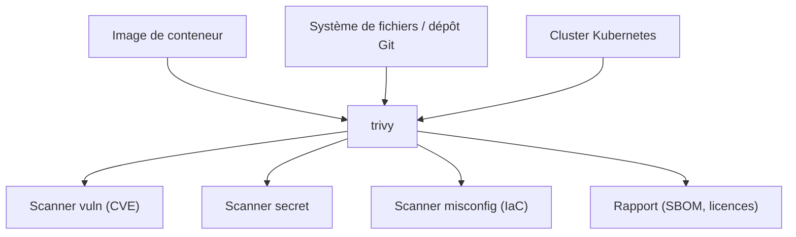

# aquasecurity/trivy

> Scanner de sécurité polyvalent : vulnérabilités, secrets, mauvaises configurations, licences.

## Le problème
Une image ou un dépôt cumule des dépendances vulnérables, des secrets oubliés et des
configurations d'infrastructure permissives, que rien ne recense d'un seul geste.

## Ce que ça fait vraiment
Croise des *cibles* et des *scanners*. Cibles : image de conteneur, système de fichiers, dépôt Git
distant, image de machine virtuelle, Kubernetes.
Scanners : paquets système et dépendances logicielles utilisées (SBOM), vulnérabilités connues
(CVE), problèmes d'infrastructure-as-code et mauvaises configurations, informations sensibles et
secrets, licences logicielles.
Couvre la plupart des langages, systèmes et plateformes courants, et s'intègre à GitHub Actions,
à un opérateur Kubernetes et à une extension VS Code.

## Comment c'est branché


## Essayer
```bash
brew install trivy
docker run aquasec/trivy
trivy image python:3.4-alpine
trivy fs --scanners vuln,secret,misconfig myproject/
trivy k8s --report summary cluster
```

## Coût et pièges
Gratuit. Les builds « canary », produits à chaque push sur `main`, sont explicitement déconseillés
en production. Le README oriente vers Aqua, le produit commercial de l'éditeur, avec un tableau
comparatif — le périmètre du gratuit peut donc bouger.

## Ce que ce n'est pas
Ce n'est pas un outil de remédiation : il signale, il ne corrige pas. Ce n'est pas un scanner
d'exécution : il analyse des artefacts et des configurations, pas le comportement en production.
La liste exacte des langages couverts n'est pas dans le README, elle renvoie à une page dédiée.

## Alternatives
- **Aqua** : produit commercial du même éditeur, bâti sur Trivy, pour un périmètre plus large.

## Pour toi
À câbler dans la CI de tes images de modèles : une commande, quatre familles de problèmes.
