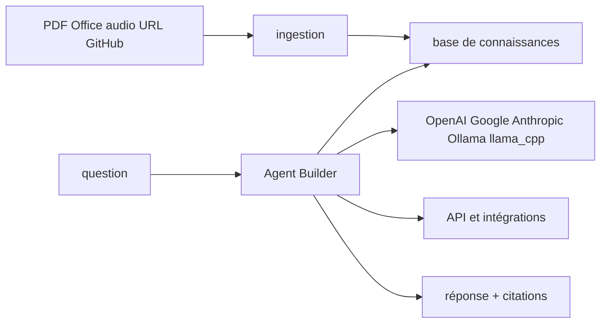

# arc53/DocsGPT

> Plateforme d'agents et de recherche documentaire privée, déployable chez toi avec le modèle de ton choix.

## Le problème
Poser une question à sa documentation interne suppose un pipeline d'ingestion, un index, et des réponses sourcées.
Assembler tout ça soi-même prend des semaines, et les réponses non citées ne sont pas exploitables.

## Ce que ça fait vraiment
Ingère PDF, DOCX, CSV, XLSX, EPUB, MD, HTML, JSON, PPTX, images, et audio MP3, WAV, M4A, OGG, WebM.
Transcrit l'audio côté serveur : notes vocales et enregistrements de réunion deviennent du corpus cherchable.
Aspire aussi des URL, sitemaps, Reddit et GitHub via des crawlers web.
Renvoie des réponses avec citations de sources, et expose des clés d'API liées à tes documents et modèles.

## Comment c'est branché


## Essayer
```bash
curl -fsSL https://docs.ac/install | bash
```
Depuis un clone : `git clone https://github.com/arc53/DocsGPT.git`, `cd DocsGPT`, puis `./setup.sh`.
L'installateur propose cinq options (API publique, local, moteur local, fournisseur cloud, image locale).

## Coût et pièges
Docker est obligatoire, l'installateur le vérifie en premier. Selon l'option retenue, la facture de jetons
est chez toi ; le mode local (Ollama, llama_cpp) l'évite au prix du matériel.

## Ce que ce n'est pas
Pas un moteur de recherche d'entreprise clé en main : c'est une plateforme à alimenter et à exploiter.
Pas garanti sans erreur : « hallucination-free » est leur formule, les citations sont ce que tu peux vérifier.
Pas un simple widget : le dépôt embarque backend Flask, frontend React, widgets et intégrations.

## Alternatives
Aucune nommée dans le README.

## Pour toi
Un socle RAG déjà assemblé, à essayer en mode local avant d'y verser la documentation d'un client.
