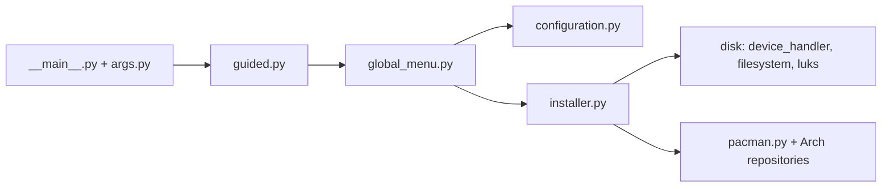

# archlinux/archinstall

> Installeur guidé ou automatisé d'Arch Linux, qui sert aussi de bibliothèque Python de gestion du système.

## Le problème
Installer Arch à la main est long ; on veut un parcours guidé ou scriptable et reproductible.

## Ce que ça fait vraiment
Menu interactif (disque, chiffrement LUKS/LVM, réseau, miroirs, utilisateurs, profils Desktop ou Server, bootloader), ou exécution à partir d'un fichier JSON de configuration et d'un fichier d'identifiants séparé, chiffrable. Les mots de passe utilisateurs sont hachés en yescrypt ; celui du chiffrement de disque doit rester en clair pour être appliqué. La bibliothèque permet d'écrire ses propres scripts d'installation. Il modifie de vrais disques.

## Comment c'est branché


## Essayer
```bash
pacman-key --init
pacman -Sy archinstall
archinstall
archinstall --config <path or URL> --creds <path or URL>
archinstall --script <name>
```

## Coût et pièges
Gratuit. Il détruit ou repartitionne des disques : tester en VM ou sur image (le README détaille QEMU). L'espace du ramdisk de l'ISO live peut manquer pour une mise à jour. Pas d'AUR ni d'assistants AUR par choix.

## Ce que ce n'est pas
Ce n'est pas un outil de déploiement de flotte ni de gestion de configuration après installation.

## Alternatives
Aucune alternative nommée dans le README.

## Pour toi
Ignorer : installeur d'un poste Arch, sans lien avec le travail data/IA/MLOps, sauf si tu automatises des installations de stations Arch.

