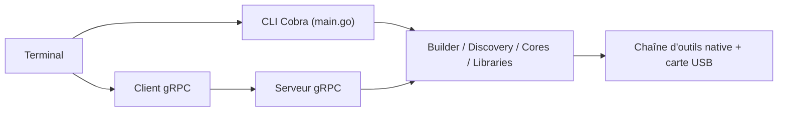

# arduino/arduino-cli

> Outil en ligne de commande et démon gRPC pour gérer, compiler et téléverser sur cartes Arduino.

## Le problème
Compiler et téléverser des programmes Arduino sans passer par l'éditeur graphique, notamment en automatisation.

## Ce que ça fait vraiment
Le README est court et renvoie à la documentation. D'après l'architecture : CLI (Cobra) et mode démon gRPC ; gestionnaires de cartes et de bibliothèques, construction de sketchs, détection de cartes, téléversement, moniteur série, débogage, téléchargement vérifié des paquets.

## Comment c'est branché


## Essayer
```bash
# Aucune commande documentée dans ce README : installation, prise en main
# et référence des commandes sont dans la documentation liée.
```

## Coût et pièges
Gratuit. Compilateurs et outils natifs de cartes téléchargés depuis des registres HTTP. Licence GPL-3.0. Versions nocturnes disponibles pour les tests.

## Ce que ce n'est pas
Pas un environnement de développement : pas d'éditeur. Le README ne présente aucune commande concrète.

## Alternatives
Aucune alternative nommée dans le README.

## Pour toi
À surveiller : utile seulement si tu compiles ou téléverses du firmware Arduino en CLI ou en CI ; sans objet sans matériel.

