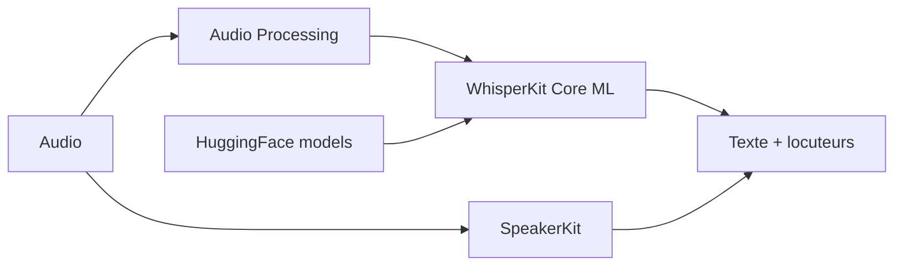

# argmaxinc/WhisperKit

> SDK Swift pour transcrire, diariser et synthétiser la voix sur appareil Apple, sans serveur.

## Le problème
Faire de la reconnaissance vocale sur iPhone ou Mac sans envoyer l'audio à un service distant.

## Ce que ça fait vraiment
Trois kits Swift dans un même paquet : WhisperKit (transcription Whisper en Core ML), SpeakerKit (diarisation Pyannote v4) et TTSKit (synthèse Qwen3-TTS, 9 voix, 10 langues, lecture en continu). Une CLI `argmax-cli` offre transcription, diarisation, synthèse et un serveur local compatible avec l'API audio OpenAI (transcription et traduction). Les modèles sont téléchargés depuis Hugging Face. Une version Pro payante existe avec temps réel et Android.

## Comment c'est branché


## Essayer
```bash
brew install whisperkit-cli
```
```bash
swift run argmax-cli transcribe --model-path "Models/whisperkit-coreml/openai_whisper-large-v3-v20240930_626MB" --audio-path "path/to/your/audio.wav"
```

## Coût et pièges
macOS 14+ et Xcode 16+. Le premier lancement télécharge les modèles (1 à 2,2 Go pour TTSKit). Le serveur local ne renvoie que `json` et `verbose_json`, avec le modèle fixé au démarrage.

## Ce que ce n'est pas
Pas multiplateforme (Apple silicon) ; la transcription temps réel avec locuteurs et Android relèvent de l'offre Pro. Le nom du dépôt (WhisperKit) diffère du paquet actuel `argmax-oss-swift`.

## Alternatives
Argmax Pro SDK, pour le temps réel et Android (offre payante du même éditeur).

## Pour toi
À adopter pour de la parole embarquée dans une app Apple ; hors écosystème Apple, il n'apporte rien.
