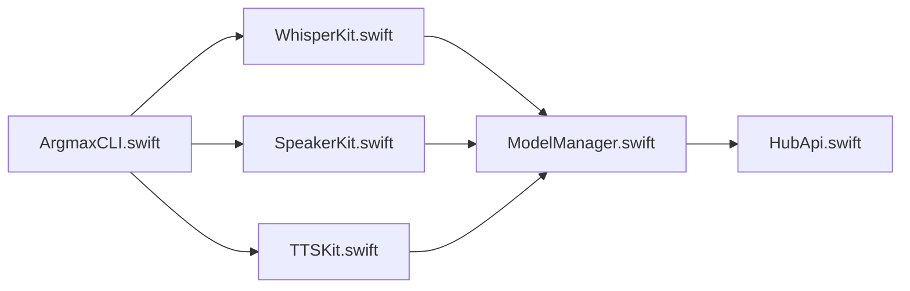

# argmaxinc/argmax-oss-swift

> Kits Swift d'inférence locale : transcription Whisper, diarisation Pyannote et synthèse vocale Qwen3-TTS sur Apple silicon.

## Le problème
Intégrer reconnaissance vocale, identification des locuteurs et synthèse vocale dans une app Apple sans serveur ni API cloud.

## Ce que ça fait vraiment
Trois produits Swift Package : WhisperKit (Whisper en CoreML), SpeakerKit (Pyannote v4) et TTSKit (Qwen3-TTS 0,6B ou 1,7B, 9 voix, 10 langues). SpeakerKit peut fusionner ses segments avec une transcription. Une CLI `argmax-cli` inclut un serveur local compatible avec l'API audio OpenAI (json et verbose_json seulement). Les modèles se téléchargent depuis HuggingFace à la première utilisation.

## Comment c'est branché


## Essayer
```bash
brew install whisperkit-cli
git clone https://github.com/argmaxinc/argmax-oss-swift.git
cd argmax-oss-swift
make setup
make download-model MODEL=large-v3-v20240930_626MB
swift run argmax-cli transcribe --model-path "Models/whisperkit-coreml/openai_whisper-large-v3-v20240930_626MB" --audio-path "path/to/your/audio.wav"
```

## Coût et pièges
Gratuit, mais les modèles pèsent de 626 Mo à 2,2 Go. macOS 14+ et Xcode 16+ requis (TTSKit : macOS 15 / iOS 18). Le README signale un SDK Pro payant avec temps réel, vocabulaire personnalisé et Android.

## Ce que ce n'est pas
Pas portable hors Apple. La version ouverte n'offre pas la transcription temps réel avec locuteurs, réservée à l'offre Pro.

## Alternatives
- Argmax Pro SDK : ajoute temps réel, vocabulaire personnalisé, Android.

## Pour toi
À surveiller : pertinent si tu livres de la voix sur Mac/iOS, hors sujet pour un pipeline serveur Linux.

