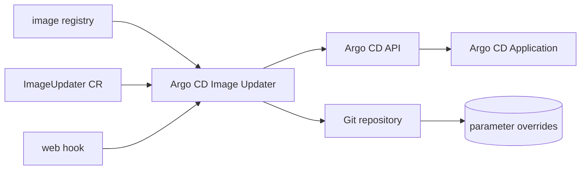

# argoproj-labs/argocd-image-updater

> **One sentence.** Automatically updates container images of Kubernetes workloads managed by Argo CD, for GitOps teams.

## The problem

Without it, every new image published to a registry means editing a tag by hand in the
manifests or parameters of an Argo CD Application, then committing and resyncing. The README
describes precisely this missing link between an image registry and a GitOps deployment.

## What it actually does

It tracks image versions for Argo CD Applications through a dedicated `ImageUpdater` custom
resource that defines how to track and update image versions. When a new image is available,
it updates the application by setting parameter overrides, either through the Argo CD API or
by committing changes to a Git repository. The README is explicit that it does not modify the
application's manifests: it writes parameter overrides only. It works solely with applications
built using *Kustomize*, *Helm* or *Plugin* (Config Management Plugin) tooling — plain YAML
applications are not supported. The roadmap marks as already done: write back to Git, web hook
support to trigger an update check for a given image, concurrency for updating multiple
applications at once, improved error handling, and support for image tags containing Git
commit SHAs.

## How it is wired



No code-derived diagram exists for this repository; the nodes above reuse the parts named in
the README (the `ImageUpdater` CR, the Argo CD API, Git-written parameter overrides, and the
webhook trigger).

## Trying it

```bash
# no installation or run command is documented in the README
```

The README defers entirely to external documentation
(`https://argocd-image-updater.readthedocs.io/en/stable/`) for setup and configuration.
Nothing is reconstructed here.

## Cost and gotchas

The code is Apache 2.0 licensed and nothing is billed. The real cost lies elsewhere: you need
a Kubernetes cluster already running Argo CD, and applications built with Kustomize, Helm or a
Config Management Plugin. Writing back to Git requires write access to the repository; the
API path requires access to the Argo CD API. The README warns that the project is under active
development and is not recommended yet for *critical* production workloads. Registry
authentication requirements are not documented in the README.

## What it is not

It is not part of Argo CD itself: it lives in `argoproj-labs`, and the README says full
integration is "probably not" happening in its current form — only an open proposal to migrate
the project into the `argoproj` org. It is not a manifest editor either: it leaves manifests
untouched and writes parameter overrides instead. And it is not universal: plain YAML
applications are unsupported, "and maybe never will be" per the README.

## Alternatives

No comparable alternative in the catalogue: the suggested neighbours (kubernetes/minikube,
kubernetes/kops, anchore/grype, moby/buildkit) deal with clusters, vulnerability scanning or
image building, not with automatic image tag updates in a GitOps flow. The README names no
competing project.

## Why it matters to you

If your models or inference services ship as images deployed by Argo CD, this is the piece that
removes the manual tag bump between build and cluster. Worth watching rather than putting
under a critical workload — the README says so itself.
