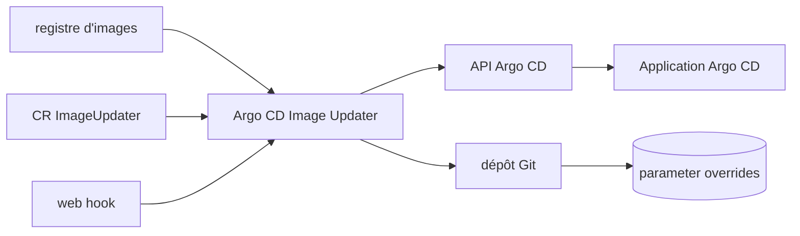

# argoproj-labs/argocd-image-updater

> **Une phrase.** Met à jour tout seul les images de conteneurs des applications Argo CD, pour équipes GitOps sur Kubernetes.

## Le problème

Sans lui, chaque nouvelle image publiée impose de modifier à la main le tag dans les manifestes
ou les paramètres d'une application Argo CD, puis de committer et resynchroniser. Le README
décrit exactement ce chaînon manquant entre un registre d'images et un déploiement GitOps.

## Ce que ça fait vraiment

Il surveille les versions d'images pour des applications Argo CD, via une ressource
personnalisée `ImageUpdater` qui décrit comment suivre et mettre à jour les tags. Quand une
nouvelle image est disponible, il applique le changement en posant des *parameter overrides* —
soit par l'API Argo CD, soit en committant dans le dépôt Git. Le README précise qu'il ne
modifie pas les manifestes de l'application : il écrit uniquement les overrides de paramètres.
Il ne fonctionne qu'avec des applications construites avec *Kustomize*, *Helm* ou *Plugin*
(Config Management Plugin) ; le YAML brut n'est pas pris en charge. La feuille de route coche
comme déjà faits l'écriture vers Git, le support de webhooks pour déclencher une vérification
d'image, la concurrence pour mettre à jour plusieurs applications à la fois et la prise en
charge de tags contenant des SHA de commit Git.

## Comment c'est branché



Aucun diagramme tiré du code n'existe pour ce dépôt ; les nœuds ci-dessus reprennent les
pièces nommées dans le README (CR `ImageUpdater`, API Argo CD, écriture Git des overrides,
webhook de déclenchement).

## Essayer

```bash
# aucune commande d'installation ou d'exécution n'est documentée dans le README
```

Le README renvoie entièrement à la documentation externe
(`https://argocd-image-updater.readthedocs.io/en/stable/`) pour l'installation et la
configuration. Rien n'est reconstruit ici.

## Coût et pièges

Le code est sous licence Apache 2.0 et rien n'est facturé. Le coût réel est ailleurs : il faut
déjà un cluster Kubernetes avec Argo CD en place, et des applications construites avec
Kustomize, Helm ou un Config Management Plugin. Si l'outil écrit vers Git, il lui faut un accès
en écriture au dépôt ; s'il passe par l'API Argo CD, un accès à cette API. Le README avertit
que le projet est en développement actif et qu'il n'est pas recommandé pour des charges de
production *critiques*. Les prérequis précis d'authentification aux registres ne sont pas
documentés dans le README.

## Ce que ce n'est pas

Ce n'est pas un composant d'Argo CD : il vit dans `argoproj-labs`, et le README indique qu'une
intégration complète n'est « probablement pas » prévue sous cette forme — seulement une
proposition ouverte de migration vers l'org `argoproj`. Ce n'est pas non plus un éditeur de
manifestes : il n'y touche pas, il n'écrit que des overrides de paramètres. Et ce n'est pas
universel : les applications en YAML brut ne sont pas supportées, « et peut-être ne le seront
jamais » selon le README.

## Alternatives

Aucune alternative comparable dans le catalogue : les voisins proposés (kubernetes/minikube,
kubernetes/kops, anchore/grype, moby/buildkit) touchent au cluster, au scan de vulnérabilités
ou à la construction d'images, pas à la mise à jour automatique des tags d'images dans un flux
GitOps. Le README ne nomme aucun projet concurrent.

## Pour toi

Si tes modèles ou services d'inférence sont livrés en images et déployés par Argo CD, c'est la
pièce qui supprime le bump de tag manuel entre le build et le cluster. À surveiller plutôt qu'à
poser sous une charge critique, le README le dit lui-même.
