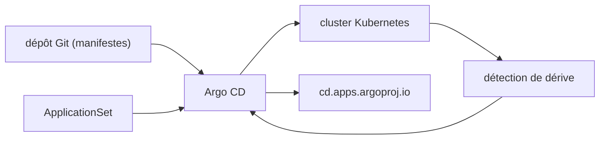

# argoproj/argo-cd

> Livraison continue déclarative en GitOps pour Kubernetes, pour équipes plateforme.

## Le problème
Déployer sur Kubernetes depuis un pipeline impératif rend l'état réel du cluster invérifiable :
on ne sait plus ce qui tourne, ni qui l'a poussé, ni comment revenir en arrière.

## Ce que ça fait vraiment
Le README est très court sur la mécanique : il pose deux principes — définitions d'applications,
configurations et environnements déclaratifs et versionnés ; déploiement et cycle de vie automatisés,
auditables et compréhensibles. Le reste du fichier est une liste de billets et de présentations
(ApplicationSet, Argo CD Image Updater, Crossplane, KubeVela, Argo Rollouts avec Istio, Kubeflow,
Helm, Renovate) et un lien vers une démo publique sur `cd.apps.argoproj.io`.

## Comment c'est branché

## Essayer
Aucune commande d'installation n'est documentée dans ce README : il renvoie à la documentation complète
et à la démo en ligne.

## Coût et pièges
Gratuit, mais suppose un cluster Kubernetes déjà en place et administré — c'est le vrai coût.
Le README ne mentionne ni prérequis de version, ni ressources, ni licence.

## Ce que ce n'est pas
Pas un CI : Argo CD déploie ce qui est dans Git, il ne construit rien. Pas un outil autonome —
sans Kubernetes il n'a pas d'objet. Ce README n'est pas une documentation : c'est une page d'entrée
avec une bibliographie, tout le contenu utile est ailleurs.

## Alternatives
- Argo Rollouts : nommé pour la livraison progressive avec Istio.
- Spinnaker, Jenkins X, Tekton : nommés dans un billet de comparaison listé au README.
- Crossplane / KubeVela : nommés pour le plan de contrôle et le modèle applicatif.

## Pour toi
Utile seulement si tu déploies tes modèles sur Kubernetes ; sinon c'est de la culture générale MLOps.
