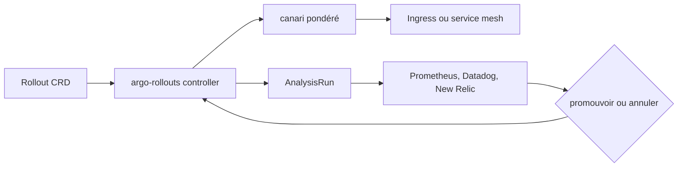

# argoproj/argo-rollouts

> Contrôleur Kubernetes qui ajoute déploiement bleu-vert, canari et analyse automatisée.

## Le problème
La stratégie `RollingUpdate` de Kubernetes n'offre aucun contrôle sur le trafic ni sur le rayon d'impact.
Elle peut stopper une progression, pas annuler et revenir en arrière toute seule.

## Ce que ça fait vraiment
Des CRD qui apportent bleu-vert, canari, expérimentation et livraison progressive.
Intégration optionnelle avec les contrôleurs d'ingress et les maillages de services pour décaler le trafic
progressivement : NGINX, ALB, Apache APISIX, Istio, Linkerd, SMI.
Interroge des fournisseurs de métriques — Prometheus, Datadog, New Relic, InfluxDB, Kayenta, jobs Kubernetes —
pour vérifier des indicateurs et décider seul de promouvoir ou d'annuler.

## Comment c'est branché


## Essayer
```bash
kubectl create namespace argo-rollouts
kubectl apply -n argo-rollouts -f https://github.com/argoproj/argo-rollouts/releases/latest/download/install.yaml
```

## Coût et pièges
Gratuit, mais il faut un cluster et, pour le décalage fin du trafic, un ingress ou un maillage compatible.
L'analyse automatisée suppose une source de métriques fiable : une mauvaise requête promeut une mauvaise version.

## Ce que ce n'est pas
Pas un remplaçant du Deployment pour tout : il vise les environnements à fort volume où le risque compte.
Pas un outil GitOps — il s'articule avec Argo CD, il ne le remplace pas.
Le jugement manuel reste une étape possible : l'automatisation n'est pas totale.

## Alternatives
Aucune alternative nommée dans le README.

## Pour toi
À connaître si tu mets un modèle en production derrière un service : le canari piloté par métriques s'y applique bien.
