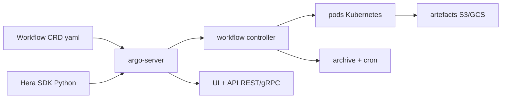

# argoproj/argo-workflows

> Moteur de workflows conteneurisés sur Kubernetes, chaque étape est un conteneur.

## Le problème
Enchaîner des jobs longs et parallèles sur Kubernetes à la main, c'est écrire et
maintenir soi-même la reprise, les dépendances et la collecte d'artefacts.

## Ce que ça fait vraiment
S'installe comme une CRD Kubernetes. On décrit un workflow en étapes séquentielles
ou en DAG de dépendances. Entrées/sorties par étape (artefacts ou paramètres),
boucles, conditions, timeouts et retries au niveau étape et workflow, suspend/resume,
memoization au resubmit. Artefacts vers S3, Artifactory, Azure Blob, GCS, HTTP, Git.
Templates de workflows stockés dans le cluster, archivage après exécution, cron,
API REST/gRPC, SSO OAuth2/OIDC, métriques Prometheus, UI de visualisation.

## Comment c'est branché

## Essayer
Aucune commande d'installation dans le README : il renvoie au « Get started here »
de la documentation et à un environnement de démonstration en ligne.

## Coût et pièges
Gratuit, projet CNCF gradué. Le coût réel est le cluster Kubernetes et le stockage
objet des artefacts. Pas d'exécution locale sans cluster.

## Ce que ce n'est pas
Pas un ordonnanceur généraliste ni un outil de data pipeline avec sémantique de
tables : c'est de l'orchestration de conteneurs. Pas d'interface Python native —
elle passe par Hera, un projet tiers. Les contributions assistées par IA doivent
suivre la politique GenAI du projet Argo.

## Alternatives
- Kubeflow Pipelines : construit dessus, orienté ML, plus opinioné.
- Netflix Metaflow : s'appuie aussi dessus, API Python d'abord.
- Kedro : structure le code data en amont plutôt que l'exécution.

## Pour toi
La brique d'orchestration à connaître dès qu'un pipeline ML tourne sur Kubernetes.
