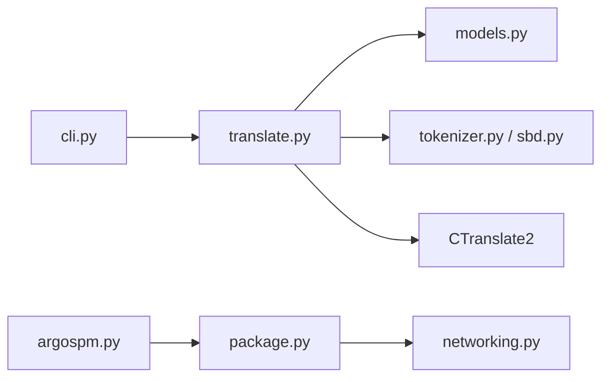

# argosopentech/argos-translate

> Bibliothèque Python de traduction automatique hors ligne, basée sur OpenNMT et CTranslate2.

## Le problème
Traduire des données sensibles ou en masse via des API cloud coûte cher et fait sortir les données.

## Ce que ça fait vraiment
Installe des paquets de modèles `.argosmodel` par paire de langues et traduit localement.
Pivot automatique par une langue intermédiaire (es → en → fr) quand la paire directe manque.
Pré/post-traitement : tokenisation, BPE, découpage en phrases, préservation des balises.
Python, CLI, GUI séparée ; GPU optionnel via `ARGOS_DEVICE_TYPE`. Base de LibreTranslate.

## Comment c'est branché


## Essayer
```bash
pip install argostranslate
argospm update
argospm install translate-en_de
argos-translate --from en --to de "Hello World!"
```

## Coût et pièges
Gratuit, MIT ; téléchargement initial des modèles. Le pivot dégrade la qualité.
Qualité inférieure aux grands services commerciaux sur certaines paires.

## Ce que ce n'est pas
Pas un LLM : traduction neuronale classique.
Pas une API web (c'est LibreTranslate).

## Alternatives
- LibreTranslate : API et appli web construites dessus.
- translate-html, argos-translate-files : pour HTML et fichiers.

## Pour toi
À adopter pour traduire des corpus en local dans tes pipelines NLP : léger, hors ligne, licence permissive.
