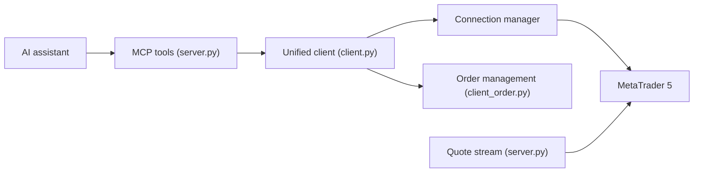

# ariadng/metatrader-mcp-server

> Pont qui laisse un assistant IA lire des données et passer des ordres sur MetaTrader 5.

## Le problème
Piloter MetaTrader 5 (compte, prix, ordres, positions) à la main, sans interface de langage naturel ni API exploitable par un assistant.

## Ce que ça fait vraiment
Bibliothèque Python avec client unifié, serveur MCP (32 outils, transports stdio, SSE, HTTP), API REST FastAPI et serveur WebSocket de cotations. Opérations : solde, prix, bougies, ordres marché et en attente, modification et fermeture de positions, historique. Un skill Claude « trading » est fourni.

## Comment c'est branché


## Essayer
```bash
pip install metatrader-mcp-server
metatrader-mcp-server --login YOUR_LOGIN --password YOUR_PASSWORD --server YOUR_SERVER --transport stdio
metatrader-quote-server --login YOUR_LOGIN --password YOUR_PASSWORD --server YOUR_SERVER
```

## Coût et pièges
Gratuit. Il faut Python 3.10+, un terminal MT5 et un compte (démo ou réel). Les identifiants passent en ligne de commande ou en `.env`. Le protocole MCP n'a pas d'authentification : le README conseille pare-feu ou tunnel SSH.

## Ce que ce n'est pas
Ce n'est pas un conseil financier ; le README décline toute responsabilité. Le skill fourni exécute les ordres sans confirmation supplémentaire.

## Alternatives
Aucune alternative nommée dans le README.

## Pour toi
À ignorer pour un usage réel : un agent qui exécute des ordres sans confirmation sur un compte réel est un risque disproportionné ; à tester seulement en compte démo.

