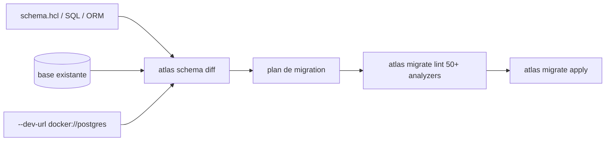

# ariga/atlas

> Gestion de schémas de base de données comme du code, en mode déclaratif ou versionné.

## Le problème
Les migrations écrites à la main dérivent du schéma réel, et rien ne prévient qu'un `ALTER` va verrouiller une table en production.

## Ce que ça fait vraiment
Mode déclaratif à la Terraform : compare l'état courant à l'état désiré (HCL, SQL ou ORM) et génère le plan de migration.
Mode versionné : planifie, linte et applique des fichiers de migration, avec 16 loaders d'ORM sur 6 langages.
Plus de 50 analyseurs détectent changements destructifs, modifications dépendantes des données, verrous et réécritures de table.
Rôles, permissions et row-level security déclarés en HCL ; tests de schéma en `.test.hcl` ; données de seed déclaratives.

## Comment c'est branché


## Essayer
```bash
brew install ariga/tap/atlas
atlas schema inspect -u "postgres://localhost:5432/mydb"
atlas migrate lint --dev-url "docker://postgres/16/dev"
atlas schema test --dev-url "docker://postgres/16/dev"
```

## Coût et pièges
Le `--dev-url` lance une base jetable, en pratique via Docker : à prévoir en CI. L'installation par défaut proposée est un `curl -sSf https://atlasgo.sh | sh`, préférer Homebrew ou l'image Docker. Le README mentionne un volet cloud (drift detection, IAM, secrets managers) sans en préciser les conditions.

## Ce que ce n'est pas
Pas un ORM ni un client SQL : il gère le schéma, pas les requêtes applicatives. `schema apply` demande confirmation interactive avant d'exécuter — à ne pas brancher en CI sans précaution. Les analyseurs signalent, ils ne réparent pas.

## Alternatives
Aucun concurrent nommé ; le README se compare seulement à Terraform pour le style déclaratif.

## Pour toi
Le lint de migration à 50 analyseurs justifie à lui seul l'adoption dès que tu fais évoluer un schéma en production.
