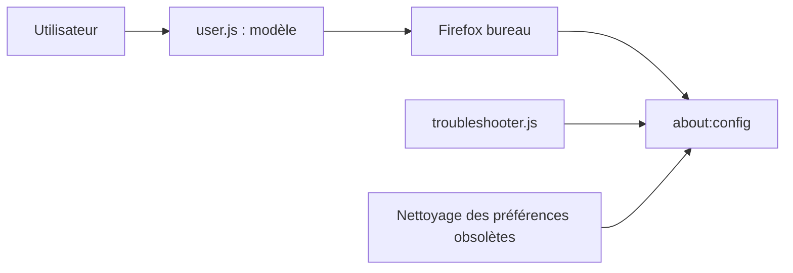

# arkenfox/user.js

> Modèle de fichier user.js qui durcit la vie privée et la sécurité de Firefox bureau.

## Le problème
Les réglages par défaut de Firefox laissent du pistage et du fingerprinting ; les durcir à la main dans about:config est long.

## Ce que ça fait vraiment
Fournit un `user.js` à copier dans le profil Firefox, qui fixe des préférences visant à réduire le pistage, au prix de pannes de sites possibles. Un script de dépannage aide à isoler la préférence fautive, un autre retire les préférences obsolètes. Un wiki et une page interactive détaillent chaque réglage.

## Comment c'est branché

## Essayer
Aucune commande dans le README : voir le wiki et les releases.

## Coût et pièges
Gratuit. Des casses de sites sont annoncées. À lire : le wiki, y compris pour les experts.

## Ce que ce n'est pas
Pas fait pour Tor Browser ni pour d'autres navigateurs Gecko. Le README déconseille Tor sur Firefox. Seuls ce dépôt et sa page sont officiels.

## Alternatives
- Aucune alternative nommée dans le README.

## Pour toi
À surveiller : utile pour durcir un navigateur de travail, mais sans lien avec un pipeline data/IA.

