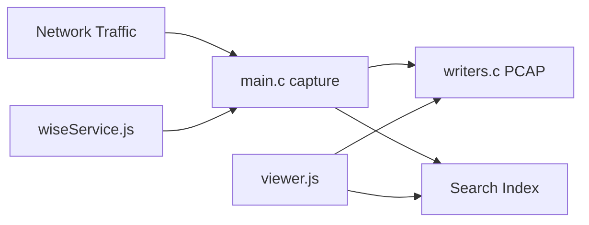

# arkime/arkime

> Capture et indexation de paquets réseau à grande échelle, avec interface web.

## Le problème
Les solutions commerciales de capture complète de paquets coûtent trop cher pour couvrir tous les réseaux.

## Ce que ça fait vraiment
`capture` (C) écoute le trafic, écrit du PCAP sur disque et envoie les métadonnées de session à OpenSearch ou Elasticsearch.
`viewer` (Node) : interface web de recherche, de vue SPI et d'export PCAP, plus une API.
En option : Cont3xt (contexte), WISE (renseignement sur les menaces), Parliament (multi-clusters), esProxy.
Il monte jusqu'à des dizaines de Gbit/s.

## Comment c'est branché


## Essayer
```bash
git clone https://github.com/arkime/arkime
./easybutton-build.sh --install
make config
```

## Coût et pièges
Il faut un cluster OpenSearch ou Elasticsearch et beaucoup de disque sur les sondes. La compilation n'est recommandée qu'aux utilisateurs avancés.

## Ce que ce n'est pas
Pas un IDS : il le complète, il ne le remplace pas.

## Alternatives
- Wireshark : pour analyser les PCAP exportés.

## Pour toi
À ignorer : c'est de l'outillage sécurité réseau, hors du périmètre data, IA ou MLOps.
