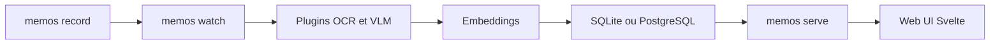

# arkohut/pensieve

> Enregistreur d'écran passif et local, avec recherche plein texte et vectorielle sur les captures.

## Le problème
Retrouver ce qu'on a vu à l'écran la semaine passée sans envoyer ses captures à un service tiers, comme le font Rewind ou Windows Recall.

## Ce que ça fait vraiment
Capture l'écran toutes les 5 secondes, déduplique, extrait le texte par OCR, calcule des embeddings et, en option, décrit les images avec un VLM via Ollama. Stockage SQLite, ou PostgreSQL avec pgvector. Interface web sur le port 8839 et un skill d'agent qui interroge l'API de recherche.

## Comment c'est branché


## Essayer
```bash
pip install memos
memos init
memos enable
memos start
memos doctor
```

## Coût et pièges
Environ 400 Mo par jour de captures. Le VLM demande un GPU NVIDIA 8 Go ou un Mac M et augmente la consommation. Sur Mac, autorisation d'enregistrement d'écran à renouveler après changement de Python. Windows : éviter le Python du Store, WSL et OneDrive.

## Ce que ce n'est pas
Ce n'est pas un chiffrement : les captures (mots de passe, banque) sont en clair dans `~/.memos`. Le paquet pip s'appelle `memos` (ancien nom du projet).

## Alternatives
Aucune alternative en dépôt ; le README cite Rewind et Windows Recall, produits fermés.

## Pour toi
Surveiller : mémoire personnelle locale bien pensée (OCR, embeddings, agent skill), mais elle capte tout ce qui passe à l'écran, sur un mainteneur unique.

