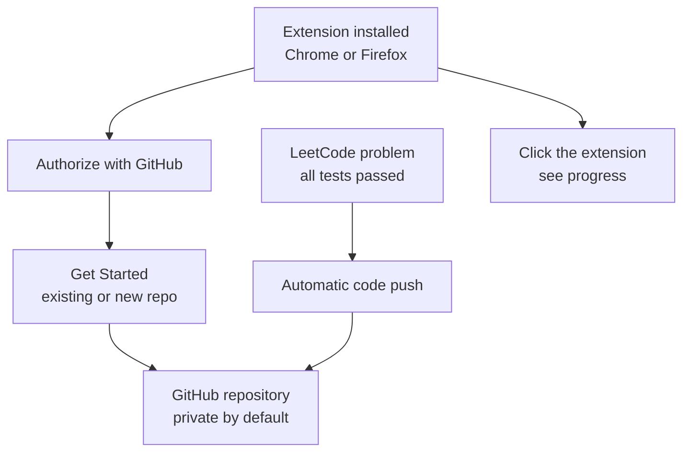

# arunbhardwaj/LeetHub-2.0

> **One sentence.** Browser extension that pushes your accepted LeetCode solutions to a personal GitHub repository.

## The problem

Copying every solved LeetCode exercise into GitHub by hand takes time, and the README notes
there is no easy way to find all your LeetCode problems gathered in one place. The original
LeetHub extension had also stopped working after changes on the LeetCode and GitHub side.

## What it actually does

A Chrome and Firefox extension that pushes your code to GitHub as soon as you pass all tests
on a LeetCode problem. The README states it is a fork of the original LeetHub, reworked to be
faster, cleaner and compatible with the new dynamic LeetCode UI. Clicking the extension shows
your progress. The destination repository is private by default.

## How it is wired

No code-derived diagram exists for this repository: the graph below is rebuilt from the flow
described in the README — install, authorize with GitHub, pick a repository, then automatic
pushes.



## Try it

For normal use the README points to the Chrome Web Store and Firefox Add-ons pages. For local
development it gives the steps: fork and clone, then

```
npm run setup
npm run build
```

and load `./dist/chrome` or `./dist/firefox` through `Load unpacked` / `Load Temporary
Add-on...`. Other listed commands: `npm run format`, `npm run format-test`, `npm run lint`,
`npm run lint-test`.

## Cost and traps

Free, MIT licensed. It depends entirely on two third-party services, LeetCode and GitHub: the
README itself recalls that earlier extensions were broken by changes on those platforms. You
must authorize the extension on your GitHub account, granting it write access to a
repository. The project is carried by a single person, who explains in the README having
started it in 2023.

## What it is not

It is not a training tool, a grader, or a solving aid: the pushed code is yours, once tests
pass. It is not a general-purpose code synchronization tool either — the scope is LeetCode to
GitHub. The README documents no other exercise platform, and no sync in the other direction.

## Alternatives

The README names the original LeetHub, which this repository forks and which it describes as
broken by LeetCode and GitHub changes. No other comparable project appears, and the brief
offers no catalogue neighbour.

## For you

Side interest for a data / MLOps profile: this is a personal record-keeping tool, not
production tooling. Worth a look mainly as a compact example of a browser extension talking
to the GitHub API, or if you keep an algorithm practice repository.
