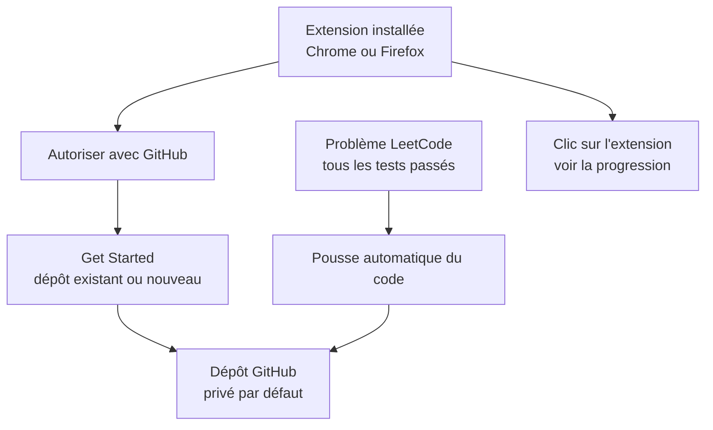

# arunbhardwaj/LeetHub-2.0

> **Une phrase.** Extension navigateur qui pousse vos solutions LeetCode acceptées vers un dépôt GitHub personnel.

## Le problème

Recopier à la main dans GitHub chaque exercice LeetCode résolu prend du temps, et le README
note qu'il n'existe pas de moyen simple de retrouver ses problèmes LeetCode rassemblés en un
seul endroit. L'extension d'origine LeetHub avait par ailleurs cessé de fonctionner après des
changements côté LeetCode et côté GitHub.

## Ce que ça fait vraiment

Une extension Chrome et Firefox qui, dès que vous passez tous les tests d'un problème
LeetCode, pousse le code vers GitHub. Le README annonce un fork de LeetHub d'origine,
retravaillé pour être plus rapide, plus propre et compatible avec la nouvelle interface
dynamique de LeetCode. Un clic sur l'extension affiche la progression. Le dépôt de
destination est privé par défaut.

## Comment c'est branché

Aucun diagramme tiré du code n'existe pour ce dépôt : le schéma ci-dessous est reconstruit
depuis le parcours décrit par le README — installation, autorisation GitHub, choix du dépôt,
puis pousses automatiques.



## Essayer

En usage courant, le README renvoie aux pages Chrome Web Store et Firefox Add-ons. Pour le
développement local, il donne la marche à suivre : forker et cloner, puis

```
npm run setup
npm run build
```

et charger `./dist/chrome` ou `./dist/firefox` via `Load unpacked` / `Load Temporary
Add-on...`. Autres commandes listées : `npm run format`, `npm run format-test`,
`npm run lint`, `npm run lint-test`.

## Coût et pièges

Gratuit et sous licence MIT. Le fonctionnement repose entièrement sur deux services tiers,
LeetCode et GitHub : le README rappelle lui-même que les extensions précédentes ont été
cassées par des changements de ces plateformes. Il faut autoriser l'extension sur son compte
GitHub, donc lui confier un droit d'écriture sur un dépôt. Le projet est porté par une seule
personne, qui explique dans le README l'avoir démarré en 2023.

## Ce que ce n'est pas

Ce n'est ni un outil d'entraînement, ni un correcteur, ni une aide à la résolution : le code
poussé est le vôtre, une fois les tests passés. Ce n'est pas non plus un outil générique de
synchronisation de code — le périmètre est LeetCode vers GitHub. Le README ne documente pas
d'autres plateformes d'exercices, ni de synchronisation dans l'autre sens.

## Alternatives

Le README nomme le LeetHub d'origine, dont ce dépôt est le fork et qu'il présente comme cassé
par les évolutions de LeetCode et de GitHub. Aucun autre projet comparable n'apparaît, et le
brief ne propose aucun voisin de catalogue.

## Pour toi

Intérêt latéral par rapport à un profil data / MLOps : c'est un outil de trace personnelle,
pas d'outillage de production. À regarder surtout comme exemple compact d'extension
navigateur qui parle à l'API GitHub, ou si vous tenez un dépôt d'entraînement algorithmique.
